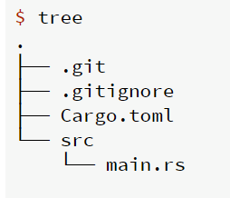
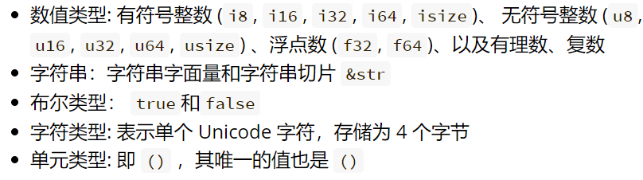
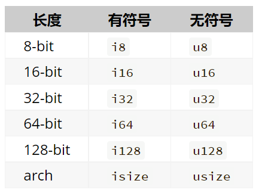
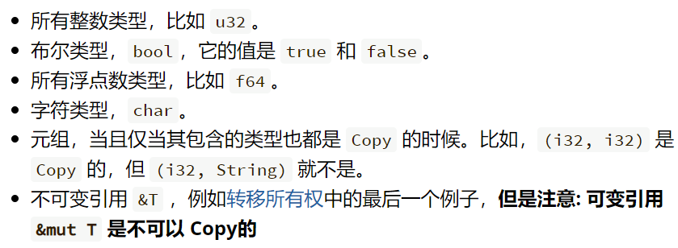
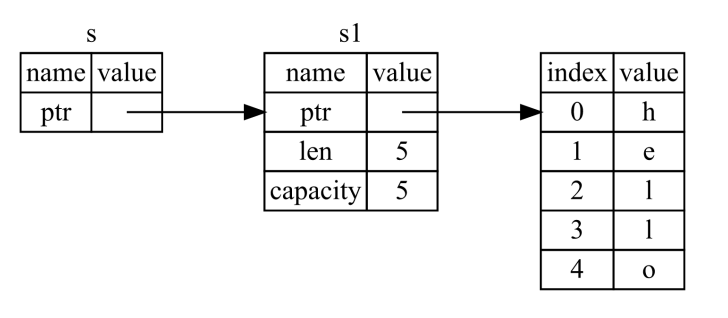
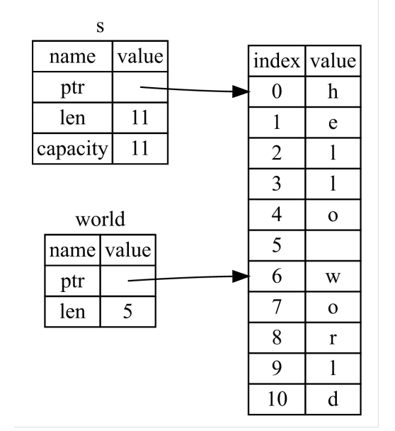
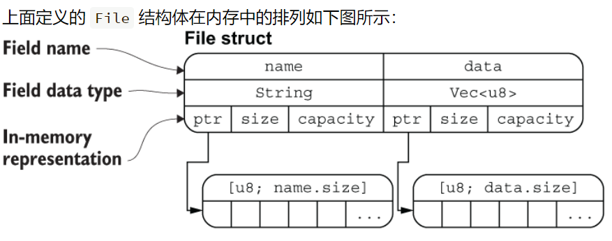
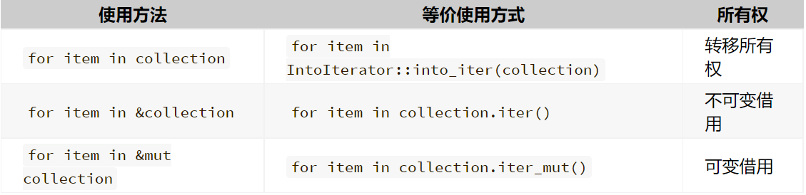
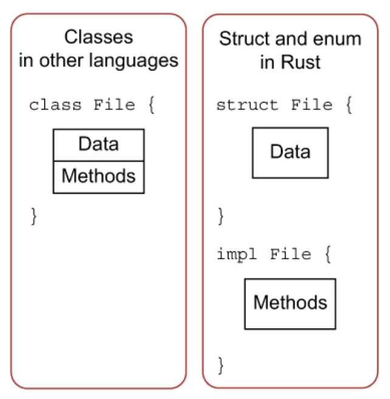
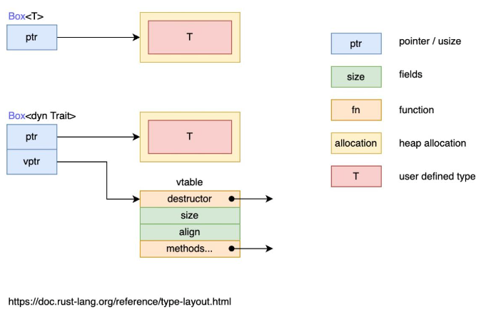

# 1.Rust语言

* 目标：构建高效且可靠的软件
  * performance：没有运行时和垃圾收集器。
    * 代码运行速度快，内存使用效率高。可用来开发对性能要求高的服务
  * reliability：用类型系统和所有权模型，来确保内存安全性和线程安全性
    * 在编译时消除各自潜在的问题
  * productivity:
    * 有丰富的文档、友好的编译器（提供有用的错误信息）和一流的工具集
    * 包括集成的包管理器和构建工具、支持各种编辑器的代码自动补全和类型查看功能、代码 自动格式化工具等

# 2.Cargo

* 是 Rust 的<u>构建系统和包管理器</u>

  * 它可以为你处理很多任务，比如构建代码、下载 dependencies 并编译这些库

* `cargo new project_name`

  * 创建一个cargo管理的项目，结构如下

    

* `cargo build`
  * 在project根目录下调用命令
  * 编译，并在`./target∕debug∕`下生成可执行文件(debug模式)
* `cargo build --release`
  * 在 `debug` 模式下，Rust 编译器不会做任何的优化，只为了尽快的编译完成，让你的开发流程更加顺畅。
  * 添加 `--release` 来编译生成高性能代码
* `cargo run`
  * 在project根目录下调用命令
  * Cargo 若发现文件并没有被改变，就不会重新编译，而是直接运行可执行文件。如果修改了源文件的话，Cargo 会在运行之前重新build项目,在运行可执行文件
* `cargo check`
  * 在project根目录下调用命令
  * 该命令快速检查代码是否可以编译，不产生可执行文件

# 3.基本语法

## 1.关键字

* Rust 语言有一组保留的 关键字（keywords），
* 就像大部分语言一样，它们只能由语言本身使用。你不能使用这些关键字作为变量或函数的名称。大部分关键字有特殊的意义，你将在 Rust 程序中使用它们完成各种任务；
* 一些关键字目前没有相应的功能，是为将来可能添加的功能保留的。可以在附录 A 中找到关键字的列表。

## 2.变量绑定

* 使用 `let` 进行变量绑定 

  * `let x = 17;`

* 变量必须初始化，否则报错

* **隐式类型**绑定: 可以不给出变量类型，由编译器根据上下文推断类型，此处 x 为 i32 类型

  * 编译器不一定总能成功推断类型（或者推断的结果不是用户想要的类型）
  * 此时可以**显式指定类型**：
    * `let x: i16 = 17;`

* **变量可变性**

  * 默认情况下，变量是<u>不可变</u>的

  * 如果要让变量可变，需要使用 `mut` 修饰

    ```rust
    let x = 5;
    x += 1; // error: re-assignment of immutable variable x
    let mut y = 5;
    y += 1; // OK!
    ```

* **变量隐藏** shadowing

  * 可以定义(`let`)一个与之前变量<u>同名的新变量</u>

    * 第二个变量”遮蔽” 第一个变量
      * 此时任何使用该变量名的行为中，都会视为是在使用第二个变量
      * 直到第二个变量自己也被隐藏或第二个变量的作用域结束（可重复使用`let`关键字来多次隐藏）
    * 可以让同一含义<u>不同类型</u>的东西使用<u>同一个变量名</u>

    ```rust
    let x = 17;
    let y = 53;
    // x is not mutable, but we're able to re-bind it
    let x = "Shadowed!";
    ```

    ```rust
    let mut cost = String::new();
    std::io::stdin().read_line(&mut cost).unwrap();
    let cost: f64 = cost.trim().parse().unwrap();
    ```

## 3.常量 constants

* 使用`const` 关键字声明

  * **必须注明值的类型**
  * 值不允许改变

  ```rust
  const THREE_HOURS_IN_SECONDS: u32 = 60 * 60 * 3;
  ```

* 编译时常数，在<u>编译时</u>确定具体值

  * 只能被设置为<u>常量表达式</u>，而不可以是其他任何只能在运行时计算出的值

* 可以在<u>任何作用域</u>中声明，包括<u>全局作用域</u>

* 在声明它的作用域之中，常量在<u>整个程序生命周期</u>中都有效。

## 4.表达式

* 几乎所有东西都是表达式 (expressions)

  * 会返回一个值 (value) 作为结果
  * 例外：变量绑定`let` 语句不是表达式

* 单位元 unit 类型，表示空，写作 `()`

  * 类型 `()` 只有一个可取的值：`()`
  * 可以作为一个值用来占位，但是完全**不占用**任何内存
  * 是<u>默认的返回类型</u>

* 可以在表达式后加分号 `;` 来舍弃它的值，这时它返回 `()`

  * 因此，如果一个函数以分号结尾，它返回 `()`

    ```rust
    fn foo() -> i32 { 5 }	//return 5
    fn bar() -> () { () }	//return ()
    fn baz() -> () { 5; }	//return ()
    fn qux() { 5; }	//default return ()
    ```

* 由于基本上所有东西都是表达式，因此都可以绑定到变量 (作为右值)

  ```rust
  let mut x = -5;
  
  let y = if x > 0 {
  "greater"
  } else {
  "less"
  };
  
  let z = loop {
  x += 10;
  if x > 5 {
  break x;
  }
  };
  ```

## 5.语句

* 对于 Rust 语言而言，这种基于语句（statement）和表达式（expression）的方式是非常重要的，你需要能明确的区分这两个概念
* 语句只是完成了一个具体的操作，但是并没有返回值
  * 必须加 `;` 结尾
  * 不能作为右值

## 6.数据类型

* Rust 是 **静态类型**（statically typed）语言，也就是说在<u>编译时</u>就必须知道所有变量的类型

  * 可以定义变量时不指定类型
    * Rust 编译器很聪明，它可以根据变量的值和上下文中的使用方式来自动推导出变量的类型
  * 当<u>多种类型均有可能</u>时，<u>必须增加类型注解</u>，否则编译不通过

* 在 Rust 中，每一个值都属于某一个数据类型，这告诉 Rust 它被指定为何种数据，以便明确数据处理方式

  * 两类数据类型子集：标量（scalar）和复合（compound）

  * 基本类型：往往是一个最小化原子类型，无法解构为其它类型(一般意义上来说)

    

### 6.1 **标量类型**

* 代表一个单独的值
* 有四种基本的标量类型：<u>整型、浮点型、布尔类型和字符</u>类型

#### 1）整型

* 有不同的大小和符号属性

* `isize` 和 `usize` 类型依赖运行程序的计算机架构：64 位架构上它们是 64 位的， 32 位架构上它们是 32 位的

  

* 字面值 (literals) 

  * 可在末尾后缀类型名
    *  写为 `10i8`、`10u16`、`10.0f32`、`10usize` 等
  * 如果不指定类型，则默认整数为 `i32`，浮点数为 `f64`
  * 允许使用 _ 做为分隔符以方便读数`98_222`

#### 2）浮点型

* Rust 的浮点数类型是 `f32` 和 `f64` 。默认类型是 `f64`

* 浮点数采用 IEEE-754 标准表示

* 综合举例

  ```rust
  fn main() {
    // 编译器会进行自动推导，给予twenty i32的类型
    let twenty = 20;
    // 类型标注
    let twenty_one: i32 = 21;
    // 通过类型后缀的方式进行类型标注：22是i32类型
    let twenty_two = 22i32;
  
    // 只有同样类型，才能运算
    let addition = twenty + twenty_one + twenty_two;
    println!("{} + {} + {} = {}", twenty, twenty_one, twenty_two, addition);
  
    // 对于较长的数字，可以用_进行分割，提升可读性
    let one_million: i64 = 1_000_000;
    println!("{}", one_million.pow(2));
  
    // 定义一个f32数组，其中42.0会自动被推导为f32类型
    let forty_twos = [
      42.0,
      42f32,
      42.0_f32,
    ];
  
    // 打印数组中第一个值，并控制小数位为2位
    println!("{:.2}", forty_twos[0]);
  }
  ```

#### 3）拓展

* **类型转换必须是显式的**. Rust 永远也不会偷偷把你的 16bit 整数转换成 32bit 整数

* **Rust 的数值上可以使用方法**. 例如你可以用以下方法来将 `13.14` 取整：`13.14_f32.round()`，在这里我们使用了类型后缀，因为编译器需要知道 `13.14` 的具体类型

* 数字运算

  * Rust 中的所有数字类型，都支持基本数学运算：加法、减法、乘法、除法和取余

    ```rust
    fn main() {
        // 加法
        let sum = 5 + 10;
    
        // 减法
        let difference = 95.5 - 4.3;
    
        // 乘法
        let product = 4 * 30;
    
        // 除法
        let quotient = 56.7 / 32.2;
    
        // 求余
        let remainder = 43 % 5;
    }	//这些语句中的每个表达式都使用了数学运算符，并且计算结果为一个值，然后绑定到一个变量上
    ```

* 位运算：基本上和其他语言一样

* 有理数和复数：未包含在标准库中

  * 好在社区已经开发出高质量的 Rust 数值库：[num](https://crates.io/crates/num)

#### 4）布尔型

* 使用 `bool` 声明
* 有两个可能的值：`true` 和 `false`

#### 5）字符类型

* 使用 `char` 声明

* 用单引号`''`声明 `char` 字面量

* Unicode 类型, 长度为4字节

  * 所以人直觉上的 “字符” 可能与 Rust 中的 `char` 并不符合

  ```rust
  fn main() {
      let c = 'z';
      let z: char = 'ℤ'; // with explicit type annotation
      let heart_eyed_cat = '😻';
  }
  ```

### 6.2 复合类型

* Rust 有两个原生的复合类型：元组（tuple）和数组（array）

#### 1）元组类型

* <u>固定长度的、有序的、异构</u>的列表类型

  * 长度固定：一旦声明，其长度不会增大或缩小
  * 异构：将多个不同类型的值，组合进一个复合类型的主要方式

* 使用包含在圆括号`()`中的逗号`,`分隔的值列表, 来创建一个元组

  ```rust
  fn main() {
      let tup: (i32, f64, u8) = (500, 6.4, 1);
  }	//可以不声明tup类型，让编译器猜
  ```

* 可以使用点号 `.`后跟值的索引（下标）来直接访问元组分量，例如 `tup.0`

* 解构

  * 因为元组是一个单独的复合元素。为了从元组中获取单个值，可以使用 `let` , 模式匹配（pattern matching）来解构（destructure）元组值

    ```rust
    fn main() {
        let tup = (500, 6.4, 1);
    	let (a, b, c) = (72, 'H', 5.1);
        let (x, y, z) = tup;
        println!("The value of y is: {y}");
    }
    ```

* 不带任何值的元组有个特殊的名称，叫做 **单元（unit）** 元组。这种值以及对应的类型都写作 `()`，表示空值或空的返回类型。

#### 2) 数组类型

* <u>固定长度的，有序的，同类的</u>列表类型

  * 数组中的每个元素的类型必须相同
  * 数组长度是固定的

* 将数组的值写成在方括号 `[]` 内，用逗号 `,` 分隔, 创建一个数组

  * 数组的类型声明： `[T; N]` , T 为元素类型，N 为元素数量

    ```rust
    let a: [i32; 5] = [1, 2, 3, 4, 5];
    ```

  * 还可以通过在 `[]` 中指定初始值, 加`;`, 再加元素个数的方式, 来创建一个每个元素都为相同值的数组

    ```rust
    let a = [3; 5];
    ```

* 用 `[]` 来访问数组元素，数组下标从 0 开始

* 无效的数组元素访问处理

  * 运行时 (runtime) 访问数组元素，会检查是否越界。
  * 如果越界，导致 **运行时** 错误，会程序带着错误信息退出，并且没有执行最后的 `println!` 语句
    * 通过立即退出而不是允许内存访问并继续执行，Rust 让你避开此类错误。

* 切片：

  * 类型的形式为 &[T] ，T为数据类型
  * 表示引用数组中的一部分所形成的视图，不能直接创建，需要从别的变量借用 (borrow)

#### 3）字符串

* Rust 有两种字符串：String 和 &str

* String 是在堆上分配空间、可以增长的字符序列

* &str 是 String 的切片类型

  * 形如 "foo" 的字符串字面值都是 &str 类型的

  ```rust
  let s: &str = "galaxy";
  let s2: String = "galaxy".to_string(); 	//显示类型转换
  let s3: String = String::from("galaxy");
  let s4: &str = &s3;
  ```

#### 4）向量 Vec < T >

* 标准库提供的类型，可直接使用。

  * Vec 是分配在堆上的、可增长的数组

* 表示泛型，使用时代入实际的类型

* 使用 Vec::new() 或 vec! 宏来创建 Vec

  ```rust
  // Explicit typing
  let v0: Vec<i32> = Vec::new();
  // v1 and v2 are equal
  let mut v1 = Vec::new();
  v1.push(1);
  v1.push(2);
  v1.push(3);
  let v2 = vec![1, 2, 3];
  // v3 and v4 are equal
  let v3 = vec![0; 4];
  let v4 = vec![0, 0, 0, 0];
  let v2 = vec![1, 2, 3];
  let x = v2[2]; // 3
  ```

  * 向量可以像数组一样使用 [] 来访问元素
    * 若用变量作为下标，必须使用 usize 类型的值，因为 usize 保证和指针是一样长度的
    * 其他类型要显式转换成 usize

## 7.函数

* 函数名和变量名使用 蛇形命名法 (snake case)

* 函数的位置可以随便放，Rust 不关心我们在哪里定义了函数，只要有定义即可

* 函数定义：

  ```rust
  fn foo(x: T, y: U, z: V) -> T {
  // ...
  }
  ```

  * Rust 是强类型语言，必须显式定义函数的<u>参数和返回值的类型</u>
    * 实际上编译器是可以推断函数的参数和返回值的类型的，但是 Rust 的设计者认为显式指定是 一种更好的实践。
    * 而且，在知道函数需要什么类型后，编译器就能够给出更有用的错误消息。

* 函数返回

  * 在 Rust 中，函数的返回值，等同于函数体<u>最后一个表达式的值</u>

  * 使用 `return` 关键字和指定值，可从函数中提前返回；

    * 但大部分函数隐式的返回最后的表达式

  * 若没有显示定义返回值类型，则默认为`()`

    ```rust
    fn main() {
        let x = plus_or_minus(5);
    
        println!("The value of x is: {}", x);
    }
    ```

## 8. 控制流

* if

  * 格式

    * 与 C++ 不同，条件部分不需要用小括号括起来
    * 整个条件语句是当做一个表达式来求值的，因此<u>每个分支都</u>必须是<u>相同类型的表达式</u>
      * 代码块的值是其最后一个表达式的值
      * 当然，如果作为普通的条件语句来使用的话，可以令类型是 ()

    ```rust
    if x > 0 {
    10
    } else if x == 0 {
    0
    } else {
    println!("Not greater than zero!");
    -10
    }
    ```

  * 条件 **必须** 是 `bool` 值

    * Rust 并不会尝试自动地将非布尔值转换为布尔值

  * 由于 `if` 是一个表达式，我们可以在 `let` 语句的右侧使用它

    ```rust
    fn main() {
        let condition = true;
        let number = if condition { 5 } else { 6 };
    
        println!("The value of number is: {number}");
    }
    ```

* 循环

  * while

    * while 的用法与 C++ 相同，只是条件部分不需要用小括号括起来

      ```rust
      let mut x = 0;
      while x < 100 {
      x += 1;
      println!("x: {}", x);
      }
      ```

  * loop

    * `loop` 关键字. 告诉 Rust 一遍又一遍地执行一段代码直到你明确要求停止 `break` 

      * 相当于 while true

    * `break` 语句可以返回一个值，作为整个循环的求值结果

      * 另外两种循环没 有这个功能

      ```rust
      let mut x = 0;
      let y = loop {
      x += 1;
      if x * x >= 100 {
      break x;
      }
      };
      ```

    * 循环标签：在多个循环之间消除歧义

      * 你可以选择在一个循环上指定一个 **循环标签**（*loop label*），然后将标签与 `break` 或 `continue` 一起使用

  * for：

    * 使用迭代器 (iterators) 表达式，遍历集合中的元素

      * `n..m` 创建一个从 n 到 m 半闭半开区间的迭代器。
      * `n..=m` 创建一个从 n 到 m 闭区间的迭代器。
      * 很多数据结构可以当做迭代器来使用，比如数组、切片，Vec 等等

      ```rust
      // Loops from 0 to 9.
      for x in 0..10 {
      println!("{}", x);
      }
      let xs = [0, 1, 2, 3, 4];
      // Loop through elements in a slice of `xs`.
      for x in &xs {
      println!("{}", x);
      }
      ```

  * 匹配语句

    * 由一个表达式 (x) 和一组 value => expression 的分支语句组成
    * 整个匹配语句被视为一个表达式来求值
      * 与 if 类似，所有分支都必须是同样类型的值
    * 下划线 (_) 用于捕捉所有情况
    * 高级
      * 匹配的表达式可以是任意表达式，包括元组和函数调用。 
        * 构成模式 (patterns)。 
        * 匹配可以绑定变量，_ 用来忽略不需要的部分
      * 为了通过编译，必须写穷尽的匹配模式。 
      * 可以用 if 来限制匹配的条件

    ```rust
    let x = 3;
    match x {
    1 => println!("one fish"), // <- comma required
    2 => {
    println!("two fish");
    println!("two fish");
    }, // <- comma optional when using braces
    _ => println!("no fish for you"), // "otherwise" case
    }
    ```

## 9.代码风格

* 名字 

  * 骆驼形式（CamelCase）：类型名 
  * 蛇形形式（snake_case）：变量名、函数名 

* 缩进与空白 

  * Rust 的缩进用 4 个空格字符。 
  * 符号前后的空格操作符
    * 前后各有一个空格，例如 x + 1。 
    * 分隔符后面有一个空格，例如 f(x, 1)。 

* 注释之道 

  * 写注释 
  * 写有意义的注释 
  * 尽量用英文写注释


# 4.所有权

## 1.什么是所有权

### 1.1 前言

* Rust 之所以能成为万众瞩目的语言，就是因为其<u>内存安全性</u>
  * 在计算机语言不断演变过程中，出现了三种流派来管理内存
    * **垃圾回收机制(GC)**，在程序运行时不断寻找不再使用的内存
      * 典型代表：Java、Go
    * **手动管理内存的分配和释放**, 在程序中，通过函数调用的方式来申请和释放内存
      * 典型代表：C++
    * **通过所有权来管理内存**，编译器在编译时会根据一系列规则进行检查
      * 这种检查<u>只发生在编译期</u>，因此对于程序运行期，<u>不会有任何性能上的损失</u>
* Stack & Heap
  * 栈和堆的核心目标, 就是为程序在<u>运行时提供可供使用的内存空间</u>。

    * 但对于 Rust 这样的系统编程语言，值是位于栈上还是堆上非常重要, 因为这会影响程序的行为和性能
  * 栈：栈中的所有数据，都必须占用<u>已知且固定大小</u>的内存空间
  * 堆：对于大小未知或者可能变化的数据，我们需要将它存储在堆上。是一种缺乏组织的数据结构
    * 分配：
      * 当向堆上放入数据时，需要请求一定大小的内存空间。操作系统在堆的某处找到一块足够大的空位，把它标记为已使用，并返回一个表示该位置地址的**指针**, 该过程被称为**在堆上分配内存**
      * 接着，该指针会被推入**栈**中（指针的大小是已知且固定的）。在后续使用过程中，你将通过栈中的**指针**，访问堆的数据
  * 性能区别：
    * 写入方面：入栈比在堆上分配内存要快
    * 读取方面：访问堆上的数据比访问栈上的数据慢
      * 得益于 CPU 高速缓存，栈数据往往可以直接存储在 CPU 高速缓存中，而堆数据只能存储在内存中
    * 因此，处理器处理和分配在<u>栈上数据</u>会比在堆上的数据<u>更加高效</u>
  * 堆栈与内存管理
    * 栈：当你的代码调用一个函数时，传递给函数的<u>参数</u>（包括可能指向<u>堆上数据的指</u>针和函数的<u>局部变量</u>）依次被压入栈中，当函数调用结束时，这些值将被从栈中按照相反的顺序<u>依次移除</u>
    * 堆：因为堆上的数据缺乏组织，因此跟踪这些数据何时分配和释放是非常重要的，否则堆上的数据将产生内存泄漏 —— 这些数据将永远无法被回收
      * Rust 所有权系统能为堆数据管理，提供强大保障

### 1.2 所有权原则

* 三大规则

  * Rust 中每一个值都<u>被一个变量所拥有</u>，该变量被称为值的 **Owner**
  * 一个值同时<u>只能被一个变量</u>所拥有，或者说一个值只能拥有一个 Owner
  * 当 Owner (变量) 离开<u>作用域</u>范围时，这个值将被丢弃(drop)
    * 对于在堆上分配的数据，这意味着在拥有它的变量离开作用域后，就被自动释放
      * Rust 会自动为我们调用一个特殊的函数 drop

* 变量作用域

  * 一个变量在程序中有效的范围
  * 一个变量，从创建到作用域结束这段区间，是有效的
    * 就作用域来说，Rust 语言跟其他编程语言没有区别

  ```rust
  fn main() {
  {                      // s 在这里无效，它尚未声明
      let s = "hello";   // 从此处起，s 是有效的
      // 使用 s
  }                      // 此作用域已结束，s不再有效
  }
  ```

### 1.3 变量绑定

* 所有权绑定

  * 通过变量绑定语句 `let` ，使变量拥有数据的所有权
  * 实际上的操作为：定义一个变量，且“绑定”一个内存的值

  ```rust
  let s1 = String::from("hello");
  let x = 5;
  ```

### 1.4 `let x = y` 变量间赋值问题的不同处理

场景：用一个变量给另一个变量“赋值”时

* 只在栈上的数据：**拷贝**

  * Rust 定义了 Copy 特型 (trait)，表示一种类型可以拷贝，而不是用默认的移动语义

  * 行为

    * 再在栈上创建另一份与x相同的值，绑定给y

  * 原因

    * 这种类型轻量级，且位于栈上，直接使用<u>按位进行</u>的拷贝行为，性能很高

  * 大多数基本类型是 Copy 类型（i32、f64、char、bool 等等）。

    

  * 包含引用的类型不是 Copy 类型（例如，Vec、String）

    ```rust
    # fn main() {
    let x = 5;
    let y = x;	//2个5都被放入了栈中,x和y都是有效的
    # }
    ```

* 默认行为：**移动**所有权

  * 移动(move)操作：

    * 当 `let y = x` 后，Rust 把原来 `x` 对应的内存值的**所有权，从 `x` 转移给了 `y`**。且认为 `x` 不再有效（不能再访问 `x`）

  * 对于在<u>堆上存储的复杂类型</u>，有点像c++中的“浅拷贝”。但使x无效了，成功避免了“二次释放”问题

    * 移动所有权是编译时的语义，不涉及程序运行时的数据移动。因而高效
    * 移动所有权 + 所有权三大规则，使 Rust 能够在编译时发现内存分配的潜在隐患，从而抛出编译错误，高可靠

    ```rust
    let s1 = String::from("hello");
    let s2 = s1;
    
    println!("{}, world!", s1); //error
    ```

* 拓展：克隆(深拷贝)

  * 对于复杂类型，Rust 永远也<u>不会自动</u>创建数据的 “深拷贝”。	

    * 因为涉及到运行时堆上的内存分配，很慢
    * 保证了任何**自动**的复制都不是深拷贝，可以被认为对运行时性能影响较小

  * 非要复制堆上的数据，可以使用一个叫做 `clone` 的方法

    ```rust
    let s1 = String::from("hello");
    let s2 = s1.clone();
    
    println!("s1 = {}, s2 = {}", s1, s2);
    ```

### 1.5 函数传值与返回

* 在函数的参数传递过程中，也会发生 移动 或 拷贝（隐式 `let` 语句）
* 但如果每次传递参数都要移交所有权，代码会变得十分繁琐
  * 进来时，交出所有权给形参；出去后，还要交还所有权给实参
* 采用 borrow 解决
  * 通过对变量取引用，来“借用”变量中的数据的所有权，此时所有权本身并没有发生变化
  * 当引用超过作用域，借用也随之结束
  * 原来的变量一直拥有对数据的所有权

## 2.引用与借用

* 引用类型 `&T`

  * 像一个指针，因为它的<u>值是一个地址</u>，可以由此<u>访问其指向的变量数据</u>。
  * 与指针不同的是，引用确保指向<u>某个特定类型的有效值</u>

* 通过 `&` 算符取地址，对引用类型赋值

  ```rust
  fn main() {
      let x = 5;
      let y = &x;	// y类型为 &i32
  }
  ```

* 引用与所有权

  * 我们将创建一个引用的行为称为 **借用**

    * 因为引用语法，让我们做到可以使用一个值的同时，但并不拥有它的所有权。
    * 因为并不拥有这个值，所以当引用停止使用时，它所指向的值也不会被丢弃

  * 当一个<u>变量有引用</u>存在时，<u>不能移交</u>它所绑定的数据的所有权

  * 在函数的参数传递中，采用引用类型，避免所有权的来回传递

    ```rust
    fn main() {
        let s1 = String::from("hello");
    
        let len = calculate_length(&s1);
    
        println!("The length of '{}' is {}.", s1, len);
    }
    
    fn calculate_length(s: &String) -> usize {
        s.len()
    }// 这里，s 离开了作用域。但因为它并不拥有引用值的所有权，
      // 所以什么也不会发生
    ```

    

  * 可变与不可变引用
    * 不可变引用（默认），不允许修改引用的值
    * 可变引用，允许修改一个引用的值
  * **引用的规则**
    * 同一作用域，特定数据最多只能有<u>一个可变引用</u>
    * 同一作用域，特定数据的<u>可变引用与不可变引用不能同时存在</u>
    * 不能在某个对象不存在后，继续保留对它的引用（禁止悬垂引用）
    * [作用]：
      * 使 Rust 在<u>编译期</u>就<u>避免数据竞争</u>。以下行为会造成数据竞争
        * 两个或更多的指针同时访问同一数据
        * 至少有一个指针被用来写入数据
        * 没有同步数据访问的机制
      * 数据竞争会导致未定义行为，这种行为很可能超出我们的预期，难以在运行时追踪，并且难以诊断和修复
      * 而 Rust 避免了这种情况的发生，因为它甚至不会编译存在数据竞争的代码！

  * 引用的作用域

    * 早期的时候，引用的作用域跟变量作用域是一致的，某个花括号位置结束

    * 现在，采用 非词法生命周期 (NLL）

      * 2018 版新特性 
      * 对象或引用的生命周期取决于<u>控制流图</u>，而不是词法作用域

    * 引用的作用域变为：从创建开始，一直持续到它<u>最后一次使用</u>的地方（引用的生命周期提前结束）

      ```rust
      fn main() {
         let mut s = String::from("hello");
      
          let r1 = &s;
          let r2 = &s;
          println!("{} and {}", r1, r2);
          // 新编译器中，r1,r2作用域在这里结束
      	
          let r3 = &mut s;
          println!("{}", r3);
      } // 老编译器中，r1、r2、r3作用域在这里结束
        // 新编译器中，r3作用域在这里结束
      ```

      ```rust
      fn main() {
      let v = vec![1, 2, 3];
      let v_ref = &v;
      let v_new = v;	//新版本不会报错
      }
      ```

## 3. Slice 类型

* 切片是一种<u>特殊形态的引用</u>，表示引用序列中的一个片段
  * 所以没有引用对象的所有权
  
* 构造语法
  * `&x[s..t]` 
    * x为序列名
    * 右半开区间其中 s 和 t 还可以根据情况省略
  * 可变性以及引用的约束条件, 对切片同样适用
  
* 字符串String的slice: `&str`

  ```rust
  # fn main() {
  let s = String::from("hello world");
  let hello = &s[0..5];
  let world = &s[6..11];
  # }
  ```

  

  * 字符串切片：`&str`
    * 另一种写法：`&[u8]`
    * 字符串字面值类型就是 `&str`
      * 它是一个指向二进制程序特定位置的 slice。
      * 这也就是为什么字符串字面值是不可变的；&str 是一个不可变引用

# 5.复合类型

* 概述

  * 顾名思义，复合类型是由其它类型<u>组合</u>而成的

  * 基本类型的局限性：**无法从更高的抽象层次去简化代码**，复合类型可以解决这个问题
  * 结构体就是复合类型的一种

## 1.字符串 `String`

### 1）基本概念

* 逻辑概念：由字符组成的连续集合

* Rust 在<u>语言级别</u>，只有一种字符串类型： `str`

  * 通常是以引用类型出现：`&str`，即字符串切片

* 在标准库里，还有多种不同用途的字符串类型，其中使用最广的即是 `String` 类型

  * `str` 类型是硬编码进可执行文件，也无法被修改
  * `String` 则是一个可增长、可改变且具有所有权的 UTF-8 编码字符串
    * 对 `String` 取引用，还是 `&str`

  * 当 Rust 用户提到字符串时，往往指的就是 `String`类型和 `&str` 字符串切片类型，这两个类型都是 UTF-8 编码
    * UTF-8编码
      * 字符串中，每个字符都是 **UTF-8** 编码，<u>长度不固定</u>，为 1~4B
      * 跟 `char` 不同，char是 Unicode 类型，占据 4B
      * 有助于大幅降低字符串所占用的内存空间

* 除了 `String` 类型的字符串，Rust 的标准库还提供了其他类型的字符串，例如 `OsString`， `OsStr`， `CsString` 和` CsStr` 等

### 2）字符串索引访问字符

* Rust不允许字符串索引 

  ```rust
  let s1 = String::from("hello");
  let h = s1[0];	//error
  ```

* 原因

  * UTF-8变长，取单个字节通常无意义
  * 因为索引操作，我们总是期望它的性能表现是 O(1)，然而对于 `String` 类型来说，无法保证这一点，因为 Rust 可能需要从 0 开始去遍历字符串来定位合法的字符

### 3）字符串切片 `&str`

* 字符串切片是非常危险的操作，因为切片的索引是通过字节来进行

* 需要程序员保证，索引的字节刚好落在<u>字符的边界上</u>，否则会造成程序崩溃

* 如中文，UTF-8中为3字节编码：

  ```rust
  let hello = "中国人";
  let s = &hello[0..2];	//会直接造成崩溃
  ```

### 4）操作字符串

* 对于可变字符串 `String` ,下面介绍 Rust 字符串的修改，添加，删除等常用方法

* 追加 Push

  * 使用 `push()` 方法, 在字符串<u>尾部</u>追加<u>字符</u> `char`

  * 使用 `push_str()` 方法，在字符串<u>尾部</u>追加<u>字符串字面量</u>

  * 说明

    * 都是在<u>原有的字符串</u>上追加，并不会返回新的字符串
    * 由于要修改原来的字符串，字符串必须是<u>可变的</u>，即字符串变量必须由 `mut` 关键字修饰

    ```rust
    fn main() {
        let mut s = String::from("Hello ");
        s.push('r');
        println!("追加字符 push() -> {}", s);
    
        s.push_str("ust!");
        println!("追加字符串 push_str() -> {}", s);
    }
    ```

* 插入 Insert

  * 使用 `insert()` 方法, 插入单个字符 `char`

  * `insert_str()` 方法, 插入字符串字面量

  * 说明

    * 需要传入两个参数
      * 第一个参数是字符（串）插入位置的索引 (把后面的往后挤)
        * 索引从 0 开始计数，如果越界则会发生错误
      * 第二个参数是要插入的字符（串），
    * 由于字符串插入操作要修改原来的字符串，则该字符串必须是<u>可变</u>的，即字符串变量必须由 `mut` 关键字修饰

    ```rust
    fn main() {
        let mut s = String::from("Hello rust!");
        s.insert(5, ',');
        println!("插入字符 insert() -> {}", s);
        s.insert_str(6, " I like");
        println!("插入字符串 insert_str() -> {}", s);
    }
    ```

* 替换 Replace

  * 把字符串中的某个字符串替换成其它的字符串

  * `replace()` 方法：

    * 可适用于 `String` 和 `&str` 类型
    * 接收两个参数
      * 第一个参数是要被替换的字符串
      * 第二个参数是新的字符串
    * 说明
      * 该方法会替换<u>所有匹配到</u>的字符串。
      * 该方法是返回一个<u>新的字符串</u>，而不是操作原来的字符串

    ```rust
    fn main() {
        let string_replace = String::from("I like rust. Learning rust is my favorite!");
        let new_string_replace = string_replace.replace("rust", "RUST");
        dbg!(new_string_replace);
    }
    ```

  * `replacen()` 方法

    * 可适用于 `String` 和 `&str` 类型
    * 接收三个参数
      * 前两个参数与 `replace()` 方法一样
      * 第三个参数是替换的个数
    * 说明：
      * 该方法是返回一个<u>新的字符串</u>，而不是操作原来的字符串

    ```rust
    fn main() {
        let string_replace = "I like rust. Learning rust is my favorite!";
        let new_string_replacen = string_replace.replacen("rust", "RUST", 1);
        dbg!(new_string_replacen);
    }
    ```

  * `replace_range` 方法

    * 仅适用于 `String` 类型

    * 接收两个参数

      * 第一个参数是要替换字符串的范围（Range）
      * 第二个参数是新的字符串

    * 说明

      * 该方法是直接操作<u>原来的字符串</u>，不会返回新的字符串。
      * 该方法需要使用 `mut` 关键字修饰

      ```rust
      fn main() {
          let mut string_replace_range = String::from("I like rust!");
          string_replace_range.replace_range(7..8, "R");
          dbg!(string_replace_range);
      }
      ```

* 删除 Delete

  * 都仅适用于 `String` 类型

  * `pop()` 

    * 删除并返回字符串的<u>最后一个字符</u>

    * 该方法是直接操作原来的字符串

      * 需要 `mut` 类型

    * 存在返回值，其返回值是一个 `Option` 类型，如果字符串为空，则返回 `None`

      ```rust
      fn main() {
          let mut string_pop = String::from("rust pop 中文!");
          let p1 = string_pop.pop();
          let p2 = string_pop.pop();
          dbg!(p1);
          dbg!(p2);
          dbg!(string_pop);
      }
      ```

  * `remove()` 

    * 删除并返回字符串中<u>指定位置的字符</u>

    * 该方法是直接操作原来的字符串

      * 需要 `mut` 类型

    * 只接收一个参数，表示该<u>字符起始索引</u>位置

    * 存在返回值，其返回值是删除位置的字符串

    * 是按照<u>字节</u>来处理字符串的

      * 如果参数所给的位置不是合法的字符边界，则会发生错误

      ```rust
      fn main() {
          let mut string_remove = String::from("测试remove方法");
          println!(
              "string_remove 占 {} 个字节",
              std::mem::size_of_val(string_remove.as_str())
          );
          // 删除第一个汉字
          string_remove.remove(0);
          // 下面代码会发生错误
          // string_remove.remove(1);
          // 直接删除第二个汉字
          // string_remove.remove(3);
          dbg!(string_remove);
      }
      ```

  * `truncate()` 

    * 删除字符串中从<u>指定位置开始到结尾</u>的全部字符

    * 该方法是直接操作原来的字符串

      * 需要 `mut` 类型

    * 只接收一个参数，表示该<u>字符起始索引</u>位置

    * 无返回值

    * 是按照<u>字节</u>来处理字符串的

      * 如果参数所给的位置不是合法的字符边界，则会发生错误

      ```rust
      fn main() {
          let mut string_truncate = String::from("测试truncate");
          string_truncate.truncate(3);
          dbg!(string_truncate);
      }
      ```

  * `clear()`

    * 清空字符串。调用后，删除字符串中的所有字符

      * 相当于 `truncate()` 方法参数为 0 的时候

    * 该方法是直接操作原来的字符串

      * 需要 `mut` 类型

      ```rust
      fn main() {
          let mut string_clear = String::from("string clear");
          string_clear.clear();
          dbg!(string_clear);
      }
      ```

* 连接 Concatenate

  * 使用 `+` 或者 `+=` 

    * 要求右边的参数必须为字符串的切片引用（Slice）类型

      * 不能直接传递 `String` 类型

    * 都是返回一个新的字符串。

      ```rust
      fn main() {
          let string_append = String::from("hello ");
          let string_rust = String::from("rust");
          // &string_rust会自动解引用为&str
          let result = string_append + &string_rust;
          let mut result = result + "!";
          result += "!!!";
      
          println!("连接字符串 + -> {}", result);
      }
      ```

    * 当调用 + 的操作符时，相当于调用了 std::string 标准库中的 `add()` 方法

      * S 调用 `add()` 方法后，会丧失所有权

      ```rust
      fn add(self, s: &str) -> String
      ```

  * 使用 `format!` 

    * 适用于 `String` 和 `&str`

      ```rust
      fn main() {
          let s1 = "hello";
          let s2 = String::from("rust");
          let s = format!("{} {}!", s1, s2);
          println!("{}", s);
      }
      ```

* 字符串转义

  * 可以通过转义的方式 `\` 输出 ASCII 和 Unicode 字符

* 操作 UTF-8 字符串

  * `chars()` 方法

    * 以 Unicode 字符的方式遍历字符串

      ```rust
      for c in "中国人".chars() {
          println!("{}", c);
      }
      ```

  * `bytes()` 方法

    * 返回字符串的<u>底层字节数组</u>表现形式

      ```rust
      for b in "中国人".bytes() {
          println!("{}", b);
      }
      /*输出
      228
      184
      173
      229
      155
      189
      228
      186
      186 */
      ```

  * 获取子串

    * 想要准确的从 UTF-8 字符串中获取子串是较为复杂的事情
    * 使用标准库你是做不到的。 你需要在 `crates.io` 上搜索 `utf8` 来寻找想要的功能

### 5）深入字符串

* `str` 
  * 字符串字面值，在编译时就知道其内容，最终字面值文本被直接硬编码进可执行文件中
  * 这使得字符串字面值快速且高效，这主要得益于字符串字面值的不可变性
* `String` 
  * 为了支持一个可变、可增长的文本片段
  * 需要在<u>堆</u>上分配一块在编译时未知大小的内存来存放内容，这些都是在程序运行时完成的
    * 首先向操作系统请求内存来存放 `String` 对象
      * 由 `String::from` 完成，它创建了一个全新的 `String`
    * 在使用完成后，将内存释放，归还给操作系统
      * 在所属变量离开作用域时，自动调用 `drop` 函数，释放内存
      * 比如，一般在 `}` 处自动调用 `drop`。

## 2.元组

* 由多种类型组合到一起形成的
  * <u>固定长度的、有序的、异构</u>的列表类型

* 创建语法 `()`

  ```rust
  fn main() {
      let tup: (i32, f64, u8) = (500, 6.4, 1);
  }
  ```

* 获取元素值

  * 可以使用模式匹配或者 `.` 操作符来获取元组中的值

  * 模式匹配

    * 解构：用<u>同样的形式</u>把一个复杂对象中的值匹配出来

    * <u>一次性</u>把元组中的值<u>全部或者部分</u>获取出来

      ```rust
      fn main() {
          let tup = (500, 6.4, 1);
      
          let (x, y, z) = tup;
      
          println!("The value of y is: {}", y);
      }
      ```

      * 元组中对应的值会绑定到变量 x， y， z上

  * 用 `.` 访问

    * 访问某个特定元素

    * 元组的索引从 0 开始

      ```rust
      fn main() {
          let x: (i32, f64, u8) = (500, 6.4, 1);
      
          let five_hundred = x.0;
      
          let six_point_four = x.1;
      
          let one = x.2;
      }
      ```

## 3.结构体 `struct`  

### 1) 概述

* 一个更高级的数据结构，提供更高层次的抽象功能
* 由多种类型组合而成，但比元组更加灵活和强大
  * 可以为内部的每个字段起一个富有含义的名称
  * 无需依赖这些字段的顺序来访问和解析它们

### 2) 语法

* 定义结构体

  * 关键字 `struct` 定义
  * 结构体 `名称`
  * 有名字的结构体 `字段 field` (也可以没有名称)

  ```rust
  struct User {
      active: bool,
      username: String,
      email: String,
      sign_in_count: u64,
  }
  ```

* 创建结构体实例

  * 以结构体的名字开头，然后在`{}`中使用 `key: value` 键-值对的形式提供字段
  * 注意
    * 初始化实例时，<u>每个字段</u>都必须要进行初始化
    * 初始化时的字段顺序不需要和结构体定义时的顺序一致

  ```rust
  let user1 = User {
          email: String::from("someone@example.com"),
          username: String::from("someusername123"),
          active: true,
          sign_in_count: 1,
      };
  ```

* 简化结构体创建

  * 可简化如下形式的结构体创建函数

    * 当函数参数和结构体字段同名时，可以直接使用缩略的方式进行初始化

    ```rust
    fn build_user(email: String, username: String) -> User {
        User {
            email,
            username,
            active: true,
            sign_in_count: 1,
        }
    }
    ```

  * 结构体更新语法

    * Rust支持根据已有的<u>同类型结构体实例</u>，创建新的结构体实例，的简化语法

    * `.. user1` 

      * `..` 语法表明凡是我们没有显式声明的字段，全部从 `user1` 中自动获取
      * `..user1` 必须在结构体的<u>尾部使用</u>

      ```rust
      let user2 = User {
              email: String::from("another@example.com"),
              ..user1
          };
      ```

    * 跟赋值语句 `=` 非常相像，如果field不是copy特性，将会发生<u>所有权转移</u>

      * 作为结果，`user1` 对应的字段将无法再被使用
      * 但其他所有权没转移的其它字段，还能被继续使用

      ```rust
      let user1 = User {
          email: String::from("someone@example.com"),
          username: String::from("someusername123"),
          active: true,
          sign_in_count: 1,
      };
      let user2 = User {
          active: user1.active,
          username: user1.username,
          email: String::from("another@example.com"),
          sign_in_count: user1.sign_in_count,
      };
      println!("{}", user1.active);
      // 下面这行会报错
      println!("{:?}", user1);
      ```

* 访问结构体字段

  * 通过 `.` 操作符即可访问结构体实例内部的字段值，也可以修改它们

    * 必须要将<u>结构体实例</u>声明为 `mut`，才能修改其中的字段

      * 结构体没有<u>域级</u>的可变性控制
        * 但可以通过 Cell 类型来实现，后面会讲
      * 可变性是变量绑定的属性，跟<u>类型无关</u>（即没有在定义 `struct` 时加入`mut` 这种语法）

      ```rust
      struct Point {
      x: i32,
      mut y: i32, // Illegal!
      }
      ```

### 3) 结构体的内存排列

* 如下代码的内存排列如图：
  * `File` 结构体两个字段 `name` 和 `data` 分别拥有底层两个 [u8] 数组的所有权

```rust
#[derive(Debug)]
 struct File {
   name: String,
   data: Vec<u8>,
 }

 fn main() {
   let f1 = File {
     name: String::from("f1.txt"),
     data: Vec::new(),
   };

   let f1_name = &f1.name;
   let f1_length = &f1.data.len();

   println!("{:?}", f1);
   println!("{} is {} bytes long", f1_name, f1_length);
 }
```



### 4) 特别结构体

* 元组结构体

  * field 没有名称的结构体

    * 种结构体长得很像元组，因此被称为元组结构体
    * 在你希望有一个整体名称，但是又不关心里面字段的名称时将非常有用

  * 可以像元组那样通过数字来访问域 ` x.0`

    ```rust
    struct Color(i32, i32, i32);
    struct Point(i32, i32, i32);
    
    let black = Color(0, 0, 0);
    let origin = Point(0, 0, 0);
    ```

  * 可用来创建新的类型，而不仅仅只是一个别名

    * 被称为“新类型”模式 (“newtype”pattern)
    * 两种类型在结构上是相同的，但是并不等价（不是同一种类型）

    ```rust
    // Not equatable
    struct Meters(i32);
    struct Yards(i32);
    // May be compared using `==`, added with `+`, etc.
    type MetersAlias = i32;
    type YardsAlias = i32;
    ```

* 单位元结构体(Unit-like Struct)

  * 没有任何字段和属性的空结构体
    * 如果你定义一个类型，但是不关心该类型的内容, <u>只关心它的行为时</u>，就可以使用
  * 这种结构体也是可以实例化的

  ```rust
  struct AlwaysEqual;
  
  let subject = AlwaysEqual;
  
  // 我们不关心 AlwaysEqual 的字段数据，只关心它的行为，因此将它声明为单元结构体，然后再为它实现某个特征
  impl SomeTrait for AlwaysEqual {
  	//...
  }
  ```

### 5) 结构体数据的所有权

* 若像在结构体中定义引用类型（从其它对象借用数据），就必须加上生命周期，确保结构体的作用范围要比它所借用的数据的作用范围要小。
  * 否则报错

### 6) 打印结构体的信息

* 在结构体定义上方，添加 `#[derive(Debug)] `，便可在 `println!()` 中使用格式符 `{:?}` ，用Rust提供的默认形式，打印结构体信息	

  * `derive` 属性
    * 被 `derive` 标记的对象会<u>自动实现对应的默认特征代码</u>，继承相应的功能
    * 可应用于结构体和枚举定义

  ```rust
  #[derive(Debug)]
  struct Rectangle {
      width: u32,
      height: u32,
  }
  
  fn main() {
      let rect1 = Rectangle {
          width: 30,
          height: 50,
      };
  
      println!("rect1 is {:?}", rect1);
  }
  /* 输出如下
  rect1 is Rectangle { width: 30, height: 50 }
  */
  ```

  * 若想要更好的输出表现，使用 `{:#?}` 格式符，输出如下：

  ```rust
  rect1 is Rectangle {
      width: 30,
      height: 50,
  }
  ```

  * 如果还是不满足，自己实现 `Display` 特征

* 还有一个简单的输出 debug 信息的方法，那就是使用 `dbg!` 宏

  * 会拿走<u>表达式</u>的所有权，然后打印出相应的<u>文件名、行号等 debug 信息</u>，当然还有我们需要的<u>表达式的求值结果</u>
  * 最终还会把表达式值的<u>所有权返回</u>
  * `dbg!` 输出到标准错误输出 `stderr`，而 `println!` 输出到标准输出 `stdout`

  ```rust
  #[derive(Debug)]
  struct Rectangle {
      width: u32,
      height: u32,
  }
  
  fn main() {
      let scale = 2;
      let rect1 = Rectangle {
          width: dbg!(30 * scale),
          height: 50,
      };
  
      dbg!(&rect1);
  }
  /* 输出如下
  [src/main.rs:10] 30 * scale = 60
  [src/main.rs:14] &rect1 = Rectangle {
      width: 60,
      height: 50,
  } 
  */
  ```

## 4.枚举

### 1）概述

* 枚举 (enum) 允许你通过<u>列举包含的所有可能的成员</u>来定义一个枚举类型 `enum`

  * 是和类型 (sum type)，用来表示可以是<u>多选一</u>的数据
  * 其成员成为 “变体”

  ```rust
  enum Resultish {
  Ok,
  Warning { code: i32, message: String },
  Err(String)
  }
  ```

### 2）语法

* 定义

  ```rust
  enum PokerSuit {
    Clubs,
    Spades,
    Diamonds,
    Hearts,
  }
  ```

* 创建实例

  ```rust
  let heart = PokerSuit::Hearts;
  ```

  * 枚举的变体存在于<u>枚举本身的名字空间</u>中
    * `::` 操作符来访问 `PokerSuit` 下的变体
    * 可以使用 `use PokerSuit::*` 把所有变体引入当前的名字空间

### 3）更强的枚举类型

* Rust 的枚举比 C/C++、Java 等语言中的枚举要强很多
  * 任何类型的数据都可以放入枚举成员中
    * 字符串、数值、结构体甚至另一个枚举
    * 实现枚举成员“带值”，“带复合结构”的效果
* 枚举的每种<u>变体</u> (variant) 可以为：
  * 没有数据（单位元变体） 
  * 有命名的数据域（结构体变体） 
  * 有不命名的有序数据域（元组变体）
* 例：

```rust
enum Message {
    Quit,
    Move { x: i32, y: i32 },
    Write(String),
    ChangeColor(i32, i32, i32),
}

fn main() {
    let m1 = Message::Quit;
    let m2 = Message::Move{x:1,y:1};
    let m3 = Message::ChangeColor(255,255,0);
}
```

* 上述枚举类型包含四个不同的成员
  * `Quit` 没有任何关联数据
  * `Move` 包含一个<u>匿名结构体</u>
  * `Write` 包含一个 `String` 字符串
  * `ChangeColor` 包含1个元组类型
* 虽然可以使用结构类型，达到相同效果，但需定义四个不同类型的结构，无法作为一个同类型的整体使用和传参
  * 而且从代码规范角度来看，枚举的实现更简洁，代码内聚性更强，不像结构体的实现，分散在各个地方

### 4）`Option` 枚举：处理空值 `null` 

* 概述

  * 在其它编程语言中，往往都有一个 `null` 关键字。当你对这些 `null` 进行操作时，就会直接抛出**null 异常**，导致程序的崩溃，因此我们在编程时需要格外的小心去处理这些 `null` 空值
  * Rust抛弃`null`，采用 `Option` 枚举变量来表述这种结果
  * 

* 定义

  ```rust
  enum Option<T> {
      Some(T),
      None,
  }
  ```

  * 其中 `T` 是泛型参数
    * `Some(T)` 表示该枚举成员的数据类型是 `T` 。即 `Some` 可以包含任何类型的数据。
  * `Option<T>` 枚举是如此有用以至于它被包含在了 prelude 标准库中。它的成员 `Some` 和 `None` 也是如此
    * 无需使用 `Option::` 前缀就可直接使用 `Some` 和 `None`

* 示例

  ```rust
  let some_number = Some(5);
  let some_string = Some("a string");
  let absent_number: Option<i32> = None;
  ```

* 为什么 `Option<T>` 比`null` 好 ？

  * 在 Rust 中，拥有一个像 `i8` 这样类型的值时，编译器<u>确保它总是有一个有效的值</u>，我们可以放心使用而无需做空值检查

  * 为了使用一个<u>可能为空的值</u>，你必须要显式的将其放入对应类型的 `Option<T>` 中。

    * 接着，当使用这个值时，必须明确的处理值为空的情况。
    * 所以：只要一个值不是 `Option<T>` 类型，就 **可以** 安全的认定它的值不为空。
    * 这是 Rust 的一个经过深思熟虑的设计决策，来限制空值的泛滥以增加 Rust 代码的安全性

  * 什么时候处理空值：在对 `Option<T>` 进行 `T` 的运算之前, 必须将其转换为 `T`	

    * 转换过程中，就可以对`None` 进行处理，必然能捕获空值
    * 那么当有一个 `Option<T>` 的值时，如何从 `Some` 成员中取出 `T` 的值来使用它呢？
      * `Option<T>` 枚举拥有大量用于各种情况的方法，可以查它的文档
      * `match` 表达式，可以用来处理枚举的控制流结构
        * 它会根据枚举的成员运行不同的代码，这些代码可以使用匹配到的值中的数据

    ```rust
    fn plus_one(x: Option<i32>) -> Option<i32> {
        match x {
            None => None,
            Some(i) => Some(i + 1),
        }
    }
    
    let five = Some(5);
    let six = plus_one(five);
    let none = plus_one(None);
    ```

## 5.数组

### 1）概述

* 在 Rust 中，最常用的数组有两种，第一种是速度<u>很快但是长度固定</u>的 `array`，第二种是<u>可动态增长的但是有性能损耗</u>的 `Vector`
* 规定：在本书中，我们称 `array` 为数组，`Vector` 为动态数组
* 下面只讲数组 `array`

### 2）三要素:

*  长度固定，元素相同的类型，顺序线性排列
* 千万注意，Rust的基本类型 `array` 是定长的

### 3）实例化：用`[]`

```rust
//常规方法
let a = [1, 2, 3, 4, 5];
//简便方法
let b = [3 ; 5]; //包含 5 个元素，初始化值都为 3
```

* 数组类型表示：`[T;n]`

  * `i32` 是元素类型，分号后面的数字 `5` 是数组长度

    ```rust
    let a: [i32; 5] = [1, 2, 3, 4, 5];
    ```

### 4）访问元素

* 可以通过索引`[]`的方式来访问存放其中的元素

  ```rust
  fn main() {
      let a = [9, 8, 7, 6, 5];
  
      let first = a[0]; // 获取a数组第一个元素
      let second = a[1]; // 获取第二个元素
  }
  ```

* 越界访问

  * 当你尝试使用索引访问元素时，Rust 将<u>检查</u>你指定的索引是否小于数组长度。
  * 如果索引大于或等于数组长度，Rust 会出现 ***panic\***
    * 编译器会检查越界访问，这种就是 Rust 的安全特性之一

### 5）数组元素为非基础类型

* 对于复杂类型的元素，不能用`[T;n]` 这种简便写法
  * 因为本质上是在copy，而复杂类型没有深拷贝，会产生所有权问题
* 调用`std::array::from_fn()`

### 6）数组切片

* 数组切片允许我们引用数组的一部分

  ```rust
  let a: [i32; 5] = [1, 2, 3, 4, 5];
  
  let slice: &[i32] = &a[1..3];
  
  assert_eq!(slice, &[2, 3]);
  ```

* 上面的数组切片 `slice` 的类型是`&[i32]`，与之对比，数组的类型是`[i32;5]`

  * `[T;n]` 描述了一个数组的类型，而 `[T]` 描述了切片的类型， 因为切片是运行期的数据结构，它的长度无法在编译期得知，因此不能用 `[T;n]` 的形式去描述

* 切片的特点

  * 切片的长度可以与数组不同，并不是固定的，而是取决于你使用时指定的起始和结束位置
  * 创建切片的代价非常小，因为切片只是针对底层数组的一个引用

# 6.流程控制

* `if` 分支控制

  * 条件必须是 `bool` 值，Rust不会做隐式类型转换

  * **`if` 语句块是表达式**，有返回值

    * 要保证每个分支<u>返回的类型一样</u>，否则报错

    ```rust
    fn main() {
        let condition = true;
        let number = if condition {
            5
        } else {
            6
        };
    
        println!("The value of number is: {}", number);
    }
    ```

* 使用 `else if` 来处理多重条件

  * 可以将 `else if` 与 `if`、`else` 组合在一起实现更复杂的条件分支判断

  * 有一点要注意，就算有多个分支能匹配，也只有第一个匹配的分支会被执行

    ```rust
    fn main() {
        let n = 6;
    
        if n % 4 == 0 {
            println!("number is divisible by 4");
        } else if n % 3 == 0 {
            println!("number is divisible by 3");
        } else if n % 2 == 0 {
            println!("number is divisible by 2");
        } else {
            println!("number is not divisible by 4, 3, or 2");
        }
    }
    ```

* 循环控制

  * 在 Rust 语言中有三种循环方式：`for`、`while` 和 `loop`

  * `for` 循环

    * 由于 `for` 循环无需任何条件限制，也不需要通过索引来访问，因此是最安全也是最常用的

    * 语法

      * `for` 和 `in` 联动

        ```rust
        for 元素 in 集合 {
          // 使用元素干一些你懂我不懂的事情
        }
        ```

    * 注意

      * 使用 `for` 时我们往往使用<u>集合的引用形式</u>，除非你不想在后面的代码中继续使用该集合

        * 如果不使用引用的话，所有权会被转移（move）到 `for` 语句块中
        * 当然对于实现了 `copy` 特征的数组而言，并不会把元素的所有权转移

      * 如果想在循环中，**修改该元素**，可以使用 `mut` 关键字修饰引用

        ```rust
        for item in &container {
          // ...
        }
        
        for item in &mut collection {
          // ...
        }
        ```

      * 总结如下

        

    * `_` 作为循环变量：只用于控制次数，不使用

      * 在 Rust 中 `_` 的含义是忽略该值或者类型的意思

      * 如果不使用 `_`，那么编译器会给你一个 `变量未使用的` 的警告

        ```rust
        for _ in 0..10 {
          // ...
        }
        ```

  * `while` 循环

    ```rust
    fn main() {
        let mut n = 0;
    
        while n <= 5  {
            println!("{}!", n);
    
            n = n + 1;
        }
        println!("我出来了！");
    }
    ```

    * 在遍历集合元素时，`for` 并不会使用索引去访问数组，因此更安全也更简洁，同时避免 `运行时的边界检查`，性能更高

  * `loop` 循环

    * `loop` 就是一个简单的无限循环

    * 你可以在内部实现逻辑通过 `break` 关键字来控制循环何时结束

      * **break 可以单独使用，也可以带一个返回值**，有些类似 `return`

    * **loop 是一个表达式**，因此可以返回一个值

      ```rust
      fn main() {
          let mut counter = 0;
      
          let result = loop {
              counter += 1;
      
              if counter == 10 {
                  break counter * 2;
              }
          };
      
          println!("The result is {}", result);
      }
      ```

  * `continue` 和 `break`

    * 类似C++

# 7.模式匹配

* 用于为复杂的类型系统提供一个轻松的解构能力

## 1. `match` 表达式

* 通用形式

  ```rust
  match target {
      模式1 => 表达式1,
      模式2 => {
          语句1;
          语句2;
          表达式2
      },
      _ => 表达式3
  }
  ```

  * `match` 允许我们将一个值`target`与一系列的模式相比较，并根据相匹配的模式执行对应的代码

* 说明

  * `target` 
    * 是一个表达式，其返回值可以是<u>任意类型</u>，只要能跟后面的分支中的模式匹配起来即可
  * `match` 的分支
    * 一个分支有两个部分：**一个模式和针对该模式的处理代码**
      * `=>` 运算符将模式和将要运行的代码分开
    * 不同分支之间使用逗号 `,` 分隔

* 执行流程

  * 当 `match` 表达式执行时，它将目标值 `target` <u>按顺序</u>依次与每一个分支的模式相比较
  * 如果模式匹配了这个值，那么模式之后的代码将被执行。
  * 如果模式并不匹配这个值，将继续执行下一个分支。

* 例

  ```rust
  enum Coin {
      Penny,
      Nickel,
      Dime,
      Quarter,
  }
  
  fn value_in_cents(coin: Coin) -> u8 {
      match coin {
          Coin::Penny =>  {
              println!("Lucky penny!");
              1
          },
          Coin::Nickel => 5,
          Coin::Dime => 10,
          Coin::Quarter => 25,
      }
  }
  ```

* 注意

  * 穷尽匹配

    * `match` 的匹配<u>必须要穷举出所有可能</u>，
    * `_`  通配符
      *  Rust 提供的一个特殊**模式**， 
      * 通过将 `_` 其放置于其他分支后，`_` 将会匹配所有遗漏的值。（类似default）
        * 不放在最后不会报错，但没意义

  * `match` 也是一个表达式

    * `match` 的每一个分支都是一个表达式。要求<u>所有分支的表达式</u>最终<u>返回值的类型必须相同</u>

    * 匹配到的表达式的结果值，将作为整个 `match` 表达式的返回值

      ```rust
      enum IpAddr {
         Ipv4,
         Ipv6
      }
      
      fn main() {
          let ip1 = IpAddr::Ipv6;
          let ip_str = match ip1 {
              IpAddr::Ipv4 => "127.0.0.1",
              _ => "::1",
          };
      
          println!("{}", ip_str);
      }
      ```

  * **X | Y**，类似逻辑运算符 `或`，代表该分支可以匹配 `X` 也可以匹配 `Y`，只要满足一个即可

* 模式绑定

  * 模式匹配的另外一个重要功能是从模式中<u>取出绑定的值</u>

    * 不是copy特型，将会发生所有权转移

    ```rust
    enum Action {
        Say(String),
        MoveTo(i32, i32),
        ChangeColorRGB(u16, u16, u16),
    }
    
    fn main() {
        let actions = [
            Action::Say("Hello Rust".to_string()),
            Action::MoveTo(1,2),
            Action::ChangeColorRGB(255,255,0),
        ];
        for action in actions {
            match action {
                Action::Say(s) => {
                    println!("{}", s);
                },
                Action::MoveTo(x, y) => {
                    println!("point from (0, 0) move to ({}, {})", x, y);
                },
                Action::ChangeColorRGB(r, g, _) => {
                    println!("change color into '(r:{}, g:{}, b:0)', 'b' has been ignored",
                        r, g,
                    );
                }
            }
        }
    }
    ```

## 2. `if let` 匹配

* 只需要<u>单个匹配分支</u>时

  ```rust
  if let Some(3) = v {
      println!("three");
  }
  ```

* 还可以加 `else`

* 还有个类似的 `while let`

  * 作用是循环迭代直至匹配条件失败

    ```rust
    let mut v = vec![1, 2, 3];
    while let Some(x) = v.pop() {
    println!("{}", x);
    }
    ```

## 3. `matches!` 宏

* Rust 标准库中提供了一个非常实用的宏：`matches!`

  * 它可以将一个表达式跟模式进行匹配，然后返回匹配的结果 `true` or `false`

  ```rust
  let bar = Some(4);
  assert!(matches!(bar, Some(x) if x > 2));
  ```

## 4. 变量覆盖

* 无论是 `match` 还是 `if let`，他们都可以在模式匹配时覆盖掉老的值，绑定新的值：同名覆盖

  ```rust
  fn main() {
     let age = Some(30);
     println!("在匹配前，age是{:?}",age);
     if let Some(age) = age {
         println!("匹配出来的age是{}",age);
     }
  
     println!("在匹配后，age是{:?}",age);
  }
  /*输出如下
  在匹配前，age是Some(30)
  匹配出来的age是30 (被覆盖)
  在匹配后，age是Some(30)
  */
  ```

## 5. 解构 Option

```rust
fn plus_one(x: Option<i32>) -> Option<i32> {
    match x {
        None => None,
        Some(i) => Some(i + 1),
    }
}

let five = Some(5);
let six = plus_one(five);
let none = plus_one(None);
```

## 6. 模式

### 1) 概述

​	模式是 Rust 中的特殊语法，它用来匹配<u>类型中的结构和数据</u>

* 它往往和 `match` 表达式联用，以实现强大的模式匹配能力
* 一般由以下内容组合而成
  * 字面值
  * 解构的数组、枚举、结构体或者元组
  * 变量
  * 通配符
  * 占位符

### 2) 模式的应用

* `match` 分支

  * `match` 的每个分支就是一个**模式**
  * 特殊的模式 `_`，来匹配剩余的所有情况

  ```rust
  match VALUE {
      PATTERN => EXPRESSION,
      PATTERN => EXPRESSION,
      PATTERN => EXPRESSION,
  }
  ```

* `if let` 分支

  * 往往用于匹配一个模式，而忽略剩下的所有模式的场景

    ```rust
    if let PATTERN = SOME_VALUE {
    	//...
    }
    ```

* `while let` 条件循环

  * 允许只要模式匹配就一直进行 `while` 循环

    ```rust
    // Vec是动态数组
    let mut stack = Vec::new();
    
    // 向数组尾部插入元素
    stack.push(1);
    stack.push(2);
    stack.push(3);
    
    // stack.pop从数组尾部弹出元素
    while let Some(top) = stack.pop() {
        println!("{}", top);
    }
    ```

* `for` 循环

  * 这里使用 `enumerate` 方法产生一个迭代器

  * 该迭代器每次迭代会返回一个 `(索引，值)` 形式的元组，然后用 `(index,value)` 来匹配

    ```rust
    let v = vec!['a', 'b', 'c'];
    
    for (index, value) in v.iter().enumerate() {
        println!("{} is at index {}", value, index);
    }
    ```

* `let ` 语句

  * 也是一种模式匹配：匹配的值绑定到对应变量上

  * 在 Rust 中,**变量名也是一种模式**，只不过它比较朴素很不起眼

    ```rust
    let x = 5;
    ```

  * 模式和值的类型，必须相同，否则报错

    ```rust
    let (x, y, z) = (1, 2, 3);
    //Error: let (x, y) = (1, 2, 3);
    ```

* 函数参数

  * 函数参数也是模式

    ```rust
    fn print_coordinates(&(x, y): &(i32, i32)) {
        println!("Current location: ({}, {})", x, y);
    }
    
    fn main() {
        let point = (3, 5);
        print_coordinates(&point);
    }
    //&(3, 5) 会匹配模式 &(x, y)，因此 x 得到了 3，y 得到了 5
    ```

### 3) 不可驳和可驳式匹配

* 不可驳模式匹配：必须模式完全覆盖，才能匹配
  * `let` , `for` 和 `match`
* 可驳式匹配
  * `if let`

### 4）忽略模式中的值

* 可以在模式中使用 `_` 模式 / 使用一个以下划线开始的名称 / 或者使用 `..` 忽略所剩部分的值

* 使用 ` _` 忽略整个值

  * `match` 表达式最后的分支

  * 函数参数

    * 比如实现特征时，当你需要特定类型签名但是函数实现并不需要某个参数时。此时编译器就**不会警告说存在未使用的函数参数**

    ```rust
    fn foo(_: i32, y: i32) {
        println!("This code only uses the y parameter: {}", y);
    }
    
    fn main() {
        foo(3, 4);
    }
    ```

  * 使用嵌套的 `_` 忽略部分值: 

    * 在一个模式内部使用

      * 第一个匹配分支，我们不关心里面的值，只关心元组中两个元素的类型，因此对于 `Some` 中的值，直接进行忽略

      ```rust
      let numbers = (2, 4, 8, 16, 32);
      
      match numbers {
          (first, _, third, _, fifth) => {
              println!("Some numbers: {}, {}, {}", first, third, fifth)
          },
      }
      ```

* 使用一个以下划线 `_` 开始的名称, 忽略未使用变量

  * 如果你创建了一个变量却不在任何地方使用它，Rust 通常会给你一个警告。

    * 用下划线 `_` 作为变量名的开头，告诉 Rust 不要警告这个未使用的变量

    ```rust
    fn main() {
        let _x = 5;
        let y = 10;
    }
    //这里得到了警告说未使用变量 y，至于 x 则没有警告。
    ```

  * 注意,  模式绑定使用 `_` 和使用 `_x` 有微妙的不同：

    * **`_x` 仍会将值绑定到变量，而 `_` 则完全不会绑定**

* 用 `..` 忽略剩余值

  * 对于有多个部分的值，可以使用 `..` 语法来只使用部分值而忽略其它值。不用再为每一个被忽略的值都单独列出下划线

    ```rust
    struct Point {
        x: i32,
        y: i32,
        z: i32,
    }
    
    let origin = Point { x: 0, y: 0, z: 0 };
    
    match origin {
        Point { x, .. } => println!("x is {}", x),
    }
    ```

  * 还可以用 `..` 来忽略元组中间的某些值

    ```rust
    fn main() {
        let numbers = (2, 4, 8, 16, 32);
    
        match numbers {
            (first, .., last) => {
                println!("Some numbers: {}, {}", first, last);
            },
        }
    }
    //这里用 first 和 last 来匹配第一个和最后一个值。.. 将匹配并忽略中间的所有值
    ```

  * 使用 `..` 必须是无歧义的。否则Rust 会报错

### 5) 匹配守卫 *match guard*

* 是一个位于 `match` 分支模式之后的额外 `if` 条件

  * 能为分支模式提供更进一步的匹配条件

  * 模式中无法提供类如 `if x < 5` 的表达能力，我们可以通过匹配守卫的方式来实现

    ```rust
    let num = Some(4);
    
    match num {
        Some(x) if x < 5 => println!("less than five: {}", x),
        Some(x) => println!("{}", x),
        None => (),
    }
    ```

  * 若使用 **或** 运算符 `|` 来指定多个模式，匹配守卫的条件会作用于所有的模式

### 6）`@` 绑定

* 当你既想要限定分支范围，又想要使用分支的变量时，就可以用 `@` 来绑定到一个新的变量上，实现想要的功能

  ```rust
  enum Message {
      Hello { id: i32 },
  }
  
  let msg = Message::Hello { id: 5 };
  
  match msg {
      Message::Hello { id: id_variable @ 3..=7 } => {
          println!("Found an id in range: {}", id_variable)
      },
      Message::Hello { id: 10..=12 } => {
          println!("Found an id in another range")
      },
      Message::Hello { id } => {
          println!("Found some other id: {}", id)
      },
  }
  ```

* @: 前绑定后解构

  * 在绑定新变量的同时，对目标进行解构

  ```rust
  #[derive(Debug)]
  struct Point {
      x: i32,
      y: i32,
  }
  
  fn main() {
      // 绑定新变量 `p`，同时对 `Point` 进行解构
      let p @ Point {x: px, y: py } = Point {x: 10, y: 23};
      println!("x: {}, y: {}", px, py);
      println!("{:?}", p);
  
  
      let point = Point {x: 10, y: 5};
      if let p @ Point {x: 10, y} = point {
          println!("x is 10 and y is {} in {:?}", y, p);
      } else {
          println!("x was not 10 :(");
      }
  }
  ```

# 8. 方法 Method

* Rust 的方法往往跟<u>结构体、枚举、特征</u>(Trait)一起使用

* 使用方法代替函数有以下好处：

  - 不用在函数签名中重复书写 `self` 对应的类型
  - 代码的组织性和内聚性更强，对于代码维护和阅读来说，好处巨大

* 定义 `impl`

  ```rust
  struct Circle {
      x: f64,
      y: f64,
      radius: f64,
  }
  
  impl Circle {
      // new是Circle的关联函数，因为它的第一个参数不是self，且new并不是关键字
      // 这种方法往往用于初始化当前结构体的实例
      fn new(x: f64, y: f64, radius: f64) -> Circle {
          Circle {
              x: x,
              y: y,
              radius: radius,
          }
      }
  
      // Circle的方法，&self表示借用当前的Circle结构体
      fn area(&self) -> f64 {
          std::f64::consts::PI * (self.radius * self.radius)
      }
  }
  ```

  * `impl` + 类型名，指明是跟哪个类型相关联的 method

    *  Rust 的<u>对象定义和方法定义</u>是<u>分离</u>的

    * 这种数据和使用分离的方式，会给予使用者极高的灵活度

    

* `self`、`&self` 和 `&mut self`

  * 在一个 `impl` 块内
    * `Self` 指代被实现方法的结构体<u>类型</u>
    * `self` 指代<u>此类型的实例</u>
    * `&self` 和 `&mut self` 则分别为对应类型实例的不可变借用和可变借用
  * 这样的写法会让我们的代码简洁很多，而且非常便于理解
  * `self` 依然有所有权的概念
    * `self` 表示实现类型的实例的所有权转移到该方法中，这种形式用的较少
    * `&self` 表示该方法对实现类型实例的不可变借用
    * `&mut self` 表示可变借用

* 方法名跟结构体 field 名相同

  * 在 Rust 中，允许方法名跟结构体的字段名相同

    ```rust
    impl Rectangle {
        fn width(&self) -> bool {
            self.width > 0
        }
    }
    
    fn main() {
        let rect1 = Rectangle {
            width: 30,
            height: 50,
        };
    
        if rect1.width() {
            println!("The rectangle has a nonzero width; it is {}", rect1.width);
        }
    }
    ```

    * 当我们使用 `rect1.width()` 时，Rust 知道我们调用的是它的方法，如果使用 `rect1.width`，则是访问它的字段
    * 一般来说，方法跟字段同名，往往适用于实现 `getter` 访问器

* 带有多个参数的方法

  * 方法和函数一样，可以使用多个参数

* -> 运算符到哪去了？

  * Rust 有一个叫 **自动引用和解引用**的功能
    * 对于object类型的指针&object，调用object方法时，并不需要解引用，直接可以`object.something()` 调用，与实例调用的形式一致
    * 即没有为指针调用类型方式，设计一个与 `->` 等效的运算符
  * 具体工作逻辑为：
    * 当使用 `object.something()` 调用方法时，Rust 会自动为 `object` 添加 `&`、`&mut` 或 `*` ，以便使 `object` 与方法签名匹配
    * 这种形式简单得多
  * 这种自动引用的行为之所以有效，是因为方法有一个明确的接收者———— `self` 的类型
    * 在给出接收者和方法名的前提下，Rust 可以明确地计算出方法是仅仅读取（`&self`），做出修改（`&mut self`）或者是获取所有权（`self`）

* 关联函数

  * 定义在 `impl` 中，且没有 `self` 的函数
    * 因为没有 `self`，不能用 `f.read()` 的形式调用。因此它是一个函数而不是方法
    * 又在 `impl` 中，与结构体紧密关联，因此称为关联函数
  * 不能用 `.` 的方式来调用，我们需要用 `::` 来调用（位于结构体的命名空间中）

* 多个 `impl` 定义

  * Rust 允许我们为一个结构体定义多个 `impl` 块

* 为枚举实现方法

  * 我们可以像结构体一样，为枚举实现方法

# 9. 泛型和特征

## 9.1 泛型

### 1.概述

* 多态的一种体现，通过<u>抽象各种具体类型</u>为<u>一个“泛型”</u>，<u>减少代码的臃肿</u>，为程序员提供编程的便利。同时可以极大地丰富语言本身的表达能力
* 泛型可以用在 函数、结构体、枚举、方法等的定义中
  * 语法主要是加上**泛型参数** `T` 
    * 在使用 `T` 前，须对其进行声明
    * 名字可以任取，只是一个占位符号，习惯于用"T"
  * 调用方法与普通类型无异，只是可以传入参数的类型不再受限制

### 2.泛型函数

```rust
fn largest<T>(list: &[T]) -> T 
{
    //...
}
```

* 提前声明： `largest<T>` 对泛型参数 `T` 进行了声明
* 然后才在函数参数中进行使用该泛型参数 `list: &[T]` 

### 3.泛型结构

```rust
struct Point1<T> {
    x: T,
    y: T,
}	//使用泛型，可以存放任何类型的坐标值

struct Point2<T,U> {
    x: T,
    y: U,
}

fn main() {
    let integer = Point1 { x: 5, y: 10 };
    let float = Point1 { x: 1.0, y: 4.0 };
    let p = Point2 {x: 1, y :1.1};
}
```

* **提前声明**：	
  * 跟泛型函数定义类似，首先我们在使用泛型参数之前必需要进行声明 `Point<T>`
  * 接着就可以在结构体的字段类型中使用 `T` 来替代具体的类型
* `Point1<T>`中，都为 `T` 泛型的 `x`，`y` 必须为相同类型，否则报错
  * 若想要不同类型，可定义多个泛型，如 `Point2<T,U>`

### 4.泛型枚举

*  `Option<T>`: 一个拥有泛型 `T` 的枚举类型

  ```rust
  enum Option<T> {
      Some(T),
      None,
  }
  ```

* `Result<T, E>`

  ```rust
  enum Result<T, E> {
      Ok(T),
      Err(E),
  }
  ```

### 5.泛型方法

* 针对泛型结构体和泛型枚举类型，可以实现泛型方法

  ```rust
  struct Point<T> {
      x: T,
      y: T,
  }
  
  impl<T> Point<T> {
      fn x(&self) -> &T {
          &self.x
      }
  }
  
  fn main() {
      let p = Point { x: 5, y: 10 };
  
      println!("p.x = {}", p.x());
  }
  ```

  * 提前声明：
    * `impl<T>`
  * 这里的 `Point<T>` 不再是泛型声明，而是一个使用 `T` 的完整的结构体类型

* 我们还能在方法中，定义额外的泛型函数

  ```rust
  struct Point<T, U> {
      x: T,
      y: U,
  }
  
  impl<T, U> Point<T, U> {
      fn mixup<V, W>(self, other: Point<V, W>) -> Point<T, W> {
          Point {
              x: self.x,
              y: other.y,
          }
      }
  }	//mixup<V,W>为另一个泛型函数
  
  fn main() {
      let p1 = Point { x: 5, y: 10.4 };
      let p2 = Point { x: "Hello", y: 'c'};
  
      let p3 = p1.mixup(p2);
  
      println!("p3.x = {}, p3.y = {}", p3.x, p3.y);
  }
  ```

* 为<u>具体的泛型</u>类型实现方法

  * 我们能针对<u>特定的泛型类型</u>实现某个<u>特定的方法</u>，对于<u>其它泛型类型则没有</u>定义该方法

  * 例如：对于 `Point<T>` 类型，你不仅能定义基于 `T` 的方法，还能针对特定的具体类型

    ```rust
    impl Point<f32> {
        fn distance_from_origin(&self) -> f32 {
            (self.x.powi(2) + self.y.powi(2)).sqrt()
        }
    }
    ```

    * 这段代码意味着 `Point<f32>` 类型会有一个方法 `distance_from_origin`
    * 而其他 `T` 不是 `f32` 类型的 `Point<T> `实例则没有定义此方法。

### 6.const 泛型

* 基于值的泛型参数

  * 比如数组类型 `[T;N]`，如果想要分别定义 `T` 和`N` 的泛型，
    * `T` 可以是任何类型，好定义
    * 但是 `N` 只能是 `usize` 类型，无法用普通泛型定义。这便是 const 泛型的作用

* 例

  ```rust
  fn display_array<T: std::fmt::Debug, const N: usize>(arr: [T; N]) {
      println!("{:?}", arr);
  }
  fn main() {
      let arr: [i32; 3] = [1, 2, 3];
      display_array(arr);
  
      let arr: [i32; 2] = [1, 2];
      display_array(arr);
  }
  ```

  * `N` 就是 const 泛型
    * 定义的语法是 `const N: usize`
    * 表示它基于的值类型是 `usize`

### 7.const 泛型表达式

* 使用泛型表达式，对泛型能抽象的类型进行限制。若为 `false` ，不能通过编译

  ```rust
  #![allow(incomplete_features)]
  #![feature(generic_const_exprs)]
  
  fn something<T>(val: T)
  where
      Assert<{ core::mem::size_of::<T>() < 768 }>: IsTrue,
      //       ^-----------------------------^ 这里是一个 const 表达式，换成其它的 const 表达式也可以
  {
      //
  }
  fn main() {
      something([0u8; 0]); // ok
      something([0u8; 512]); // ok
      something([0u8; 1024]); // 编译错误，数组长度是1024字节，超过了768字节的参数长度限制
  }
  // ---
  pub enum Assert<const CHECK: bool> {
      //
  }
  pub trait IsTrue {
      //
  }
  impl IsTrue for Assert<true> {
      //
  }
  ```

### 8.泛型的性能

* Rust 通过在编译时进行泛型代码的 **单态化**(*monomorphization*)来保证效率
  * 单态化是一个通过<u>填充</u>编译时使用的<u>具体类型</u>，将<u>通用代码转换为特定代码</u>的过程
    * 在编译期为泛型对应的多个类型，生成各自的代码
  * 编译器的行为：正好与我们创建泛型函数的步骤相反
    * 编译器寻找所有泛型代码被调用的位置，并针对具体类型生成代码
    * 将泛型定义替换为出现类型的具体的定义
* 在 Rust 中，泛型是零成本的抽象: 在使用泛型时<u>没有运行时开销</u>
  * 即：可以使用泛型来编写不重复的代码，而 Rust 将会为每一个实例编译其特定类型的代码
  * 当代码运行，它的执行效率就跟好像<u>手写每个具体定义的重复代码一样</u>
* 但是损失了编译速度和增大了最终生成文件的大小

 ## 9.2 特征

### 1.概述

* 类似于”接口“的概念
* 定义了**一个可以被共享的行为，只要实现了特征，你就能使用该行为**
  * 只定义行为看起来是什么样的：只定义<u>函数签名</u>
  * 不定义行为具体是怎么样的：函数体的内容，需要在拥有该特征的类型中自己实现
* 编译器也会确保任何实现某特征的类型，都拥有与这个特征签名的定义完全一致的方法

### 2.定义语法

```rust
pub trait Summary {
    fn summarize(&self) -> String;
}
```

* 使用 `trait` 关键字来声明一个特征
* `Summary` 是特征名
* 在 `{}` 中定义了该特征的所有方法

### 3.实现特征

* 实现特征的语法，与为结构体、枚举方法实现很像
* `impl Summary for Post{}`
  * “为 `Post` 类型实现 `Summary` 特征”
  * 然后在 `impl` 的花括号中实现该特征的具体方法

```rust
pub trait Summary {
    fn summarize(&self) -> String;
}
pub struct Post {
    pub title: String, // 标题
    pub author: String, // 作者
    pub content: String, // 内容
}

impl Summary for Post {
    fn summarize(&self) -> String {
        format!("文章{}, 作者是{}", self.title, self.author)
    }
}

pub struct Weibo {
    pub username: String,
    pub content: String
}

impl Summary for Weibo {
    fn summarize(&self) -> String {
        format!("{}发表了微博{}", self.username, self.content)
    }
}
```

* 孤儿规则：特征定义与实现的位置

  * 如果你想要为类型 `A` 实现特征 `T`，那么 `A` 或者 `T` <u>至少有一个是</u>在<u>当前作用域</u>中<u>定义</u>的
    * 比如，不能在当前作用域中，为 `String` 类型实现标准库中的 `Display` 特征
    * 可以确保其它人编写的代码不会破坏你的代码，也确保了你不会莫名其妙就破坏了风马牛不相及的代码

* 默认实现

  * 可以在特征中定义具有**默认实现**的方法，这样无需再在其它类型中实现该方法
  * 可以被重载

  ```rust
  pub trait Summary {
      fn summarize(&self) -> String {
          String::from("(Read more...)")
      }
  }
  ```

  * 默认实现还允许调用<u>相同特征中的其他方法</u>，哪怕这些方法<u>没有默认实现</u>

### 4.特征作为函数参数

```rust
pub fn notify(item: &impl Summary) {
    println!("Breaking news! {}", item.summarize());
}
```

* `impl Summary`：**实现了`Summary`特征** 的 `item` 参数
  * 意思为：可以使用任何实现了 `Summary` 特征的类型，作为该函数的参数
  * 同时在函数体内，还可以调用该特征的方法

### 5.特征约束 (trait bound)

* `impl Trait` 这种语法非常好理解，但是实际上它只是一个<u>语法糖</u>。

  * 真正的写法：一种<u>**泛型**的约束</u>
  * 与**泛型**结合

  ```rust
  pub fn notify<T: Summary>(item: &T) {
      println!("Breaking news! {}", item.summarize());
  }
  ```

* 形如 `T: Summary` 被称为**特征约束**，表示传入的参数类型 `T` 必须实现 Summary 类型

  * 在简单的场景下 `impl Trait` 这种语法糖就足够使用。但是对于复杂的场景，特征约束可以让我们拥有更大的灵活性和语法表现能力：

    ```rust
    pub fn notify<T: Summary>(item1: &T, item2: &T) {}
    ```

    * 泛型类型 `T` 说明了 `item1` 和 `item2` 必须拥有同样的类型。而语法糖做不到这种约束

* 多重约束

  * 通过 + 指定多个 trait bound

  * 除了单个约束条件，我们还可以指定多个约束条件

  * 语法糖

    ```rust
    pub fn notify(item: &(impl Summary + Display)) {}
    ```

  * 特征约束形式

    ```rust
    pub fn notify<T: Summary + Display>(item: &T) {}
    ```

* Where 约束

  * 通过 `where`，简化特征约束很多时的写法

    ```rust
    fn some_function<T: Display + Clone, U: Clone + Debug>(t: &T, u: &U) -> i32 {}
    ```

    ```rust
    fn some_function<T, U>(t: &T, u: &U) -> i32
        where T: Display + Clone,
              U: Clone + Debug
    {}
    ```

* 在 泛型方法/特征实现 中进行约束

  * 达到 有条件地实现<u>方法或特征</u> 的效果

  * 方法实现

    * 意思：`cmp_display` 方法，并不是所有的 `Pair<T>` 结构体对象都可以拥有，只有 `T` 同时实现了 `Display + PartialOrd` 的 `Pair<T>` 才可以拥有此方法

    ```rust
    use std::fmt::Display;
    
    struct Pair<T> {
        x: T,
        y: T,
    }
    
    impl<T> Pair<T> {
        fn new(x: T, y: T) -> Self {
            Self {
                x,
                y,
            }
        }
    }
    
    impl<T: Display + PartialOrd> Pair<T> {
        fn cmp_display(&self) {
            if self.x >= self.y {
                println!("The largest member is x = {}", self.x);
            } else {
                println!("The largest member is y = {}", self.y);
            }
        }
    }
    ```

  * 特征实现

    * 例如，标准库为任何实现了 `Display` 特征的类型实现了 `ToString` 特征

    ```rust
    impl<T: Display> ToString for T {
        // --snip--
    }
    ```

### 6.特征作为函数返回类型

* 可以通过 `impl Trait` 来说明一个函数返回了一个类型，该类型实现了某个特征

  * 有个限制：只能有一个具体的类型

  ```rust
  fn returns_summarizable() -> impl Summary {
      Weibo {
          username: String::from("sunface"),
          content: String::from(
              "m1 max太厉害了，电脑再也不会卡",
          )
      }
  }
  ```

  * 对于 `returns_summarizable` 的调用者而言，他<u>只知道返回了一个实现了 `Summary` 特征的对象</u>，但是并不知道返回了一个 `Weibo` 类型

* 作用

  * 这种形式的返回值，在返回的真实类型非常复杂时很有用。
    * 因为你不知道该怎么声明时(毕竟 Rust 要求你必须标出所有的类型)，此时就可以用 `impl Trait` 的方式简单返回。
  * 例如，闭包和迭代器很复杂，只有编译器才知道那玩意的真实类型。好在你可以用 `impl Iterator` 来告诉调用者，返回了一个迭代器，因为所有迭代器都会实现 `Iterator` 特征

### 7.通过 `derive` 派生特征

*  `#[derive(Debug)]` 是一种特征派生语法。
  * 被 `derive` 标记的对象会<u>自动实现</u>对应的<u>默认特征代码</u>，继承相应的功能
  * `derive` 派生出来的是 Rust <u>默认给我们提供的特征</u>，在开发过程中极大的简化了自己手动实现相应特征的需求
* `Debug` 特征
  * 当你给一个结构体标记后，就可以使用 `println!("{:?}", s)` 的形式打印该结构体的对象
* `Copy` 特征
  * 当标记到一个类型上时，可以让这个类型自动实现 `Copy` 特征，进而可以调用 `copy` 方法，进行自我复制

### 8.特征对象

* 类似于 c++ 中虚函数机制。通过一个统一的"指针"调用同名方法，但实际执行的是各自的实现

* 使用"特征对象"类型，指向<u>所有</u>实现了<u>对应特征</u>的<u>实例</u>（一种泛指，提供一个统一的接口）

  * 具体怎么映射，这种映射关系是存储在一张表中。
  * 总之，效果为，可以在运行时通过特征对象，找到具体调用的类型方法


#### 1) 语法

* 声明类型
  *  `&dyn trait_name`  或 `Box<dyn trait_name>`
  * `dyn` 不能单独作为特征对象的定义
    * 因为特征对象可以是任意实现了某个特征的类型，编译器在编译期不知道该类型的大小，不同的类型大小是不同的
* 创建特征对象：
  *  `&x` 或 `Box::new(x) `
  * 如果 调用类型 没有实现对应特征，编译器直接就会报错，安全性

#### 2) 例

```rust
trait Draw {
    fn draw(&self) -> String;
} 

impl Draw for u8 {
    fn draw(&self) -> String {
        format!("u8: {}", *self)
    }
}

impl Draw for f64 {
    fn draw(&self) -> String {
        format!("f64: {}", *self)
    }
}

// 若 T 实现了 Draw 特征， 则调用该函数时传入的 Box<T> 可以被隐式转换成函数参数签名中的 Box<dyn Draw>
fn draw1(x: Box<dyn Draw>) {
    // 由于实现了 Deref 特征，Box 智能指针会自动解引用为它所包裹的值，然后调用该值对应的类型上定义的 `draw` 方法
    x.draw();
}

fn draw2(x: &dyn Draw) {
    x.draw();
}

fn main() {
    let x = 1.1f64;
    let y = 8u8; 
    draw1(Box::new(x));
    draw1(Box::new(y));
    draw2(&x);	//实现一个函数，接受不同类型参数的形式
    draw2(&y);
}
```

```rust
pub trait Draw {
    fn draw(&self);
}	//定义特征

pub struct Button {
    pub width: u32,
    pub height: u32,
    pub label: String,
}	

impl Draw for Button {
    fn draw(&self) {
        // 绘制按钮的代码
    }
}	//实现特征

struct SelectBox {
    width: u32,
    height: u32,
    options: Vec<String>,
}

impl Draw for SelectBox {
    fn draw(&self) {
        // 绘制SelectBox的代码
    }
}	//实现特征

pub struct Screen {
    pub components: Vec<Box<dyn Draw>>,
}	//存放 Draw 特征对象的动态数组

impl Screen {
    pub fn run(&self) {
        for component in self.components.iter() {
            component.draw();
        }
    }
}	//调用各自的draw函数

fn main() {
    let screen = Screen {
        components: vec![
            Box::new(SelectBox {
                width: 75,
                height: 10,
                options: vec![
                    String::from("Yes"),
                    String::from("Maybe"),
                    String::from("No")
                ],
            }),
            Box::new(Button {
                width: 50,
                height: 10,
                label: String::from("OK"),
            }),
        ],
    };

    screen.run();
}
```

#### 3) 动态分发

* 静态分发与动态分发

  * 静态：泛型
    * 在编译期完成处理的：编译器会为每一个泛型参数对应的具体类型生成一份代码
  * 动态：特征对象
    * 直到运行时，才能确定需要调用什么方法。编译时不能确定

* 当使用特征对象时，Rust 必须使用动态分发。

  * 编译器无法知晓所有可能用于特征对象代码的类型，所以它也不知道应该调用哪个类型的哪个方法实现

* 实现图示

  * 当类型 `Button` 实现了特征 `Draw` 时，`btn` 中保存了作为特征对象的数据指针（指向类型 `Button` 的实例数据）和行为指针（指向 `vtable`）
    * **`btn` 是哪个特征对象的实例，它的 `vtable` 中就包含了该特征的方法**
    * 所以，类型 `Button` 的实例对象 `btn` 可以当作特征 `Draw` 的特征对象类型来使用

  

  * 特征对象没有固定大小，但它的引用类型的大小是固定的，它由两个指针组成（`ptr` 和 `vptr`），因此占用两个指针大小
    * 一个指针 `ptr` 指向实现了特征 `Draw` 的具体类型的实例
      * 也就是当作特征 `Draw` 来用的类型的实例，比如类型 `Button` 的实例、类型 `SelectBox` 的实例
    * 一个指针 `vptr` 指向一个虚表 `vtable`
      * `vtable` 中保存了类型 `Button` 或类型 `SelectBox` 的实例对于可以调用的实现于特征 `Draw` 的方法
      * 调用方法时，直接从 `vtable` 中找到方法并调用 (实现了映射)

#### 4) 特征对象的限制

* 不是所有特征都能拥有特征对象，只有<u>对象安全的特征</u>才行
* 规定：当一个特征的所有方法都有如下属性时，它的对象是安全的
  * 方法的返回类型不能是 `Self`
  * 方法没有任何泛型参数
* 因为类型模糊，要避免语义模糊

### 9.深入了解特征

#### 1) 关联类型

* 基本语法

  * 在<u>特征定义</u>的语句块中，申明一个<u>自定义类型</u>，这样就可以在特征的方法签名中使用该类型

  * 跟 <u>特征泛型</u> 有点类似，更加简洁。
    * 特征泛型必须在实现函数等的头部加上泛型参数的声明
    * 而关联类型在内部定义，函数头部形式简洁，极大增加可读性

  * 定义语法: `type T`

    ```rust
    pub trait Iterator {
        type Item;
    
        fn next(&mut self) -> Option<Self::Item>; //关联类型Item在Self::命名空间中
    }
    ```

  * 例：

    ```rust
    impl Iterator for Counter {
        type Item = u32;
    
        fn next(&mut self) -> Option<Self::Item> {
            // --snip--
        }
    }
    
    fn main() {
        let c = Counter{..}
        c.next()
    }
    ```

#### 2）默认泛型类型参数

* 当定义特征，使用泛型类型参数时，可以为其指定一个默认的具体类型

* 例：标准库中的 `std::ops::Add` 特征

  ```rust
  trait Add<RHS=Self> {
      type Output;
  
      fn add(self, rhs: RHS) -> Self::Output;
  }
  ```

  * 这里给泛型参数 `RHS` 一个默认值 `Self`
  * 也就是当用户不指定 `RHS` 时（即实现特征时，使用`impl Add` ，而不是 `impl Add<SOME_TYPE>)`)
    * 默认使用两个同样类型 `Self` 的值进行相加，然后返回一个关联类型 `Output`

  ```rust
  use std::ops::Add;
  
  struct Millimeters(u32);
  struct Meters(u32);
  
  //特征的泛型参数，在实现时就要给出
  impl Add<Meters> for Millimeters {
      type Output = Millimeters;
  
      fn add(self, other: Meters) -> Millimeters {
          Millimeters(self.0 + (other.0 * 1000))
      }
  }
  ```

#### 3）调用同名方法

* 实现在同一类型的不同特征、甚至连类型本身都有同名方法时

  ```rust
  trait Pilot {
      fn fly(&self);
  }
  
  trait Wizard {
      fn fly(&self);
  }
  
  struct Human;
  
  impl Pilot for Human {
      fn fly(&self) {
          println!("This is your captain speaking.");
      }
  }
  
  impl Wizard for Human {
      fn fly(&self) {
          println!("Up!");
      }
  }
  
  impl Human {
      fn fly(&self) {
          println!("*waving arms furiously*");
      }
  }
  ```

* 策略

  * 编译器默认调用<u>类型中定义</u>的方法

  * 调用特征上的方法：

    * 使用显式调用的语法

      * 前提：方法中，必须有 `self` 参数
      * 编译器就可以根据调用的类型，决定具体调用哪个方法（必须 调用类型+特征名，才能决定是哪个具体方法）

      ```rust
      fn main() {
          let person = Human;
          Pilot::fly(&person); // 调用Pilot特征上的方法
          Wizard::fly(&person); // 调用Wizard特征上的方法
          person.fly(); // 调用Human类型自身的方法
      }
      ```

    * 完全限定语法

      * 是调用函数最为明确的方式
      * 语法
        * `<Type as Trait>::function(receiver_if_method, next_arg, ...);`
      * 例：
      
      ```rust
      fn main() {
          println!("A baby dog is called a {}", <Dog as Animal>::baby_name());
      }
      ```
    

#### 4）supertrait: 特征定义中的特征约束

* 作用

  * 说明一个特征在实现之前，需要实现先另一个特征
  * 让某个特征 A 能使用另一个特征 B 的功能

* 语法: 特征定义的特征名之后加 `: Type`

  ```rust
  use std::fmt::Display;
  
  trait OutlinePrint: Display {
      fn outline_print(&self) {
          let output = self.to_string();
          let len = output.len();
          println!("{}", "*".repeat(len + 4));
          println!("*{}*", " ".repeat(len + 2));
          println!("* {} *", output);
          println!("*{}*", " ".repeat(len + 2));
          println!("{}", "*".repeat(len + 4));
      }
  }
  ```

#### 5）newtype模式：在外部类型上实现外部特征

* 绕过孤儿规则的方法

* 使用一个<u>元组结构体</u>，创建新类型

  * 该封装类型是本地的，因此我们可以为此类型实现外部的特征

* 例

  ```rust
  use std::fmt;
  	
  struct Wrapper(Vec<String>); //newtype
  
  impl fmt::Display for Wrapper {
      fn fmt(&self, f: &mut fmt::Formatter) -> fmt::Result {
          write!(f, "[{}]", self.0.join(", "))
      }
  }
  
  fn main() {
      let w = Wrapper(vec![String::from("hello"), String::from("world")]);
      println!("w = {}", w);
  }
  ```

* 缺点:

  * 如例中，要访问里面的数组时，是 `self.0.join(", ")` 形式
    * 必须要加 `self.0`，然后才能执行 `join` 方法。很啰嗦

# 10. 集合类型

* 标准库中最常用的集合类型：`Vector`、`HashMap` 和 `String` 类型

## 10.1 Vector 动态数组

### 1. 类型

* `Vec<T>` 

### 2. 特点

* 在内存中连续排列，访问元素的成本很低
* 只能存储相同类型的元素
* 不定长

### 3. 创建

* `Vec::new()`

  ```rust
  let v: Vec<i32> = Vec::new();
  ```

  * `Vec::with_capacity(capacity)` 
  * 如果预先知道要存储的元素个数，可以使用该方法创建动态数组。可以避免因为插入大量新数据导致频繁的内存分配和拷贝，提升性能

* `vec![]` 宏

  * 与 `Vec::new` 不同，能在创建同时给予初始化值

  ```rust
  let v = vec![1, 2, 3];
  ```

### 4. 更新

* `.push()` 方法

  ```rust
  let mut v = Vec::new();
  v.push(1);
  ```

  * 与其它类型一样，必须将 `v` 声明为 `mut` 后，才能进行修改

### 5. Vector 与其元素共存亡

* 跟结构体一样，`Vector` 类型在超出作用域范围后，会被自动删除
* 它内部存储的所有内容也会随之被删除

### 6. 读取元素

* 通过下标索引 `[]` 访问

* `.get()` 方法

  * 返回类型为  `Option<&T>`，还需要 `match` 解构

  ```rust
  let v = vec![1, 2, 3, 4, 5];
  
  let third: &i32 = &v[2];
  println!("第三个元素是 {}", third);
  
  match v.get(2) {
      Some(third) => println!("第三个元素是 {}", third),
      None => println!("去你的第三个元素，根本没有！"),
  }
  ```

* 两种方法的区别

  * 数组越界的问题的处理上

    * `[]` 直接报错
    * `.get()` 方法会返回 `None`，非常安全

    ```rust
    	let v = vec![1, 2, 3, 4, 5];
    
    let does_not_exist = &v[100];//Error
    let does_not_exist = v.get(100);
    ```

### 7. 同时借用多个元素

* 借用同一个Vector的多个元素时，同样遵守 ”借用规则“
* 违法，则编译器报错
* 原因
  * 数组的大小是可变的，当旧数组的大小不够用时，Rust 会重新分配一块更大的内存空间，然后把旧数组拷贝过来。这种情况下，之前的引用显然会指向一块无效的内存

### 8. 迭代遍历 Vector 中的元素

* 如果想要依次访问数组中的元素，可以使用迭代的方式去遍历数组

  * 这种方式比用下标的方式去遍历数组更安全也更高效（不用触发边界检查）

  ```rust
  let v = vec![1, 2, 3];
  for i in &v {	//只读访问
      println!("{}", i);
  }
  
  let mut v = vec![1, 2, 3];
  for i in &mut v {	//还可修改元素
      *i += 10
  }
  ```

### 9. 拓展：存储不同类型元素的方法

* 使用枚举类型 / 特征对象

* 枚举实现

  ```rust
  #[derive(Debug)]
  enum IpAddr {
      V4(String),
      V6(String)
  }
  fn main() {
      let v = vec![
          IpAddr::V4("127.0.0.1".to_string()),
          IpAddr::V6("::1".to_string())
      ];
  
      for ip in v {
          show_addr(ip)
      }
  }
  
  fn show_addr(ip: IpAddr) {
      println!("{:?}",ip);
  }
  ```

* 特征对象实现

  ```rust
  trait IpAddr {
      fn display(&self);
  }
  
  struct V4(String);
  impl IpAddr for V4 {
      fn display(&self) {
          println!("ipv4: {:?}",self.0)
      }
  }
  struct V6(String);
  impl IpAddr for V6 {
      fn display(&self) {
          println!("ipv6: {:?}",self.0)
      }
  }
  
  fn main() {
      let v: Vec<Box<dyn IpAddr>> = vec![
          Box::new(V4("127.0.0.1".to_string())),
          Box::new(V6("::1".to_string())),
      ];
  
      for ip in v {
          ip.display();
      }
  }
  ```

  * 手动指定类型：`Vec<Box<dyn IpAddr>>`
  * 为 `V4` 和 `V6` 都实现了特征 `IpAddr`
  * 将它俩的实例用 `Box::new()` 包裹后，成功存在了数组 `v` 中

* 在实际使用场景中，**特征对象数组要比枚举数组常见很多**

  * 主要原因在于特征对象非常灵活，而编译器对枚举的限制较多，且无法动态增加类型

## 10.2 HashMap：KV 存储

* 概述

  * 存储的是一一映射的 `KV` 键值对，并提供了平均复杂度为 `O(1)` 的查询方法
  * 动态变长、内聚的（<K,V>类型一致）
  *  `HashMap` 并没有包含在 Rust 的 `prelude` 中，需要 `use std::collections::HashMap;`

* 类型

  * `HashMap<K,V>`

* 创建

  * `HashMap::new()`

    ```rust
    use std::collections::HashMap;
    
    // 创建一个HashMap，用于存储宝石种类和对应的数量
    let mut my_gems = HashMap::new();
    ```

  * `HashMap::with_capacity(capacity)`

    * 创建指定大小的 `HashMap`
    * 如果预先知道要存储的 `KV` 对个数, 使用该法，避免频繁的内存分配和拷贝，提升性能

  * 使用迭代器和 collect 方法创建

    * 将合适类型的 `Vec` 类型变为 `HashMap` 类型

    * 例：将 `Vec<(String, u32)>` 中的数据快速写入到 `HashMap<String, u32>` 中

      * `into_iter` 方法将列表转为迭代器
      * 接着通过 `collect` 进行收集
        * `collect` 方法在内部实际上支持生成多种类型的目标集合，因此我们需要通过类型标注 `HashMap<_,_>` 来告诉编译器：请帮我们收集为 `HashMap` 集合类型
        * 具体的 `KV` 类型，由编译器自己推导

      ```rust
      fn main() {
          use std::collections::HashMap;
      
          let teams_list = vec![
              ("中国队".to_string(), 100),
              ("美国队".to_string(), 10),
              ("日本队".to_string(), 50),
          ];
      
          let teams_map: HashMap<_,_> = teams_list.into_iter().collect();
      
          println!("{:?}",teams_map)
      }
      ```

* 插入

  * `.insert()`

    ```rust
    my_gems.insert("红宝石", 1);
    my_gems.insert("蓝宝石", 2);
    my_gems.insert("河边捡的误以为是宝石的破石头", 18);
    ```

* 所有权转移
  * `HashMap` 的所有权规则与其它 Rust 类型没有区别：
    - 若类型实现 `Copy` 特征，该类型会被复制进 `HashMap`，因此无所谓所有权
    - 若没实现 `Copy` 特征，所有权将被转移给 `HashMap` 中
  * **如果你使用引用类型放入 HashMap 中**，请确保该引用的生命周期至少跟 `HashMap` 活得一样久

* 查询 

  *  `.get() `

    * 返回值会用 `Option<&T>` 包裹；如果查询失败，会返回 `None`

    ```rust
    use std::collections::HashMap;
    
    let mut scores = HashMap::new();
    
    scores.insert(String::from("Blue"), 10);
    scores.insert(String::from("Yellow"), 50);
    
    let team_name = String::from("Blue");
    let score: Option<&i32> = scores.get(&team_name);//注意返回类型
    ```

* 遍历 K-V 对

  ```rust
  use std::collections::HashMap;
  
  let mut scores = HashMap::new();
  
  scores.insert(String::from("Blue"), 10);
  scores.insert(String::from("Yellow"), 50);
  
  for (key, value) in &scores {
      println!("{}: {}", key, value);
  }
  ```

* 更新值

  ```rust
  fn main() {
      use std::collections::HashMap;
  
      let mut scores = HashMap::new();
  
      scores.insert("Blue", 10);
  
      // 覆盖已有的值
      let old = scores.insert("Blue", 20);
      assert_eq!(old, Some(10));
  
      // 查询新插入的值
      let new = scores.get("Blue");
      assert_eq!(new, Some(&20));
  
      // 查询Yellow对应的值，若不存在则插入新值
      let v = scores.entry("Yellow").or_insert(5);
      assert_eq!(*v, 5); // 不存在，插入5
  
      // 查询Yellow对应的值，若不存在则插入新值
      let v = scores.entry("Yellow").or_insert(50);
      assert_eq!(*v, 5); // 已经存在，因此50没有插入
  }
  ```

* 哈希函数

  * 实现 `std::cmp::Eq` 特征的类型，不可以用作 `HashMap` 的 `Key`

    * 比如：f32 和 f64 浮点数

  * 目前，`HashMap` 使用的哈希函数是 `SipHash`，它的性能不是很高，但是安全性很高。

    * `SipHash` 在中等大小的 `Key` 上，性能相当不错，但是对于小型的 `Key` （例如整数）或者大型 `Key` （例如字符串）来说，性能还是不够好

  * 高性能三方库

    * 可以去 [`crates.io`](https://crates.io/) 上寻找其它的哈希函数实现，替换掉默认的哈希函数

      ```rust
      use std::hash::BuildHasherDefault;
      use std::collections::HashMap;
      // 引入第三方的哈希函数
      use twox_hash::XxHash64;
      
      // 指定HashMap使用第三方的哈希函数XxHash64，防止特型的第三个参数中
      let mut hash: HashMap<_, _, BuildHasherDefault<XxHash64>> = Default::default();
      hash.insert(42, "the answer");
      assert_eq!(hash.get(&42), Some(&"the answer"));
      ```

# 11.类型转换（看不懂）

## 1. `as` 转换

* 数值类型的转换

* 因为每个类型能表达的数据范围不同，如果把范围较大的类型转换成较小的类型，会造成错误，丢失数据

  ```rust
  fn main() {
     let a = 3.1 as i8;
     let b = 100_i8 as i32;
     let c = 'a' as u8; // 将字符'a'转换为整数，97
  
     println!("{},{},{}",a,b,c)
  }
  ```

## 2. `.TryInto()`

* 数值类型的转换

* `try_into` 会尝试进行一次转换，并返回一个 `Result`，此时就可以对其进行相应的错误处理

  ```rust
  use std::convert::TryInto;
  
  fn main() {
     let a: u8 = 10;
     let b: u16 = 1500;
  
     let b_: u8 = b.try_into().unwrap();
  
     if a < b_ {
       println!("Ten is less than one hundred.");
     }
  }
  ```

## 3. 通用类型转换

* 首先，在匹配特征时，不会做任何强制转换(除了方法)
  * 一个类型 `T` 可以强制转换为 `U`，不代表 `impl T` 可以强制转换为 `impl U`
* 点操作符

# 12. 返回值和错误处理

* 在很多情况下，Rust 需要你承认自己的代码可能会出错，并提前采取行动，来处理这些错误
* 主要分为两类
  * **可恢复错误**，通常用于从系统全局角度来看可以接受的错误
    * `Result<T, E>` 
    * 例如处理用户的访问、操作等错误，这些错误只会影响某个用户自身的操作进程，而不会对系统的全局稳定性产生影响
  * **不可恢复错误**，通常是全局性或者系统性的错误
    * `panic!` 
    * 例如数组越界访问，系统启动时发生了影响启动流程的错误等等，这些错误的影响往往对于系统来说是致命的

## 1. `panic!`

* 当调用执行该宏时，程序会：

  * **打印出一个错误信息**
  * **展开报错点往前的函数调用堆栈**
  * **最后退出程序**

* 一定是不可恢复的错误，才调用 `panic!` 处理，使程序崩溃退出

  * 所以，**只有当你不知道该如何处理时，再去调用 panic!**

* backtrace 栈展开

  * 回溯栈上数据和函数调用（逆序排序），给出充分的报错信息和栈调用信息

  * 命令：debug标志开启下，`RUST_BACKTRACE=1 cargo run` 

  * 在真实场景中，错误往往涉及到很长的调用链甚至会深入第三方库，如果没有栈展开技术，错误将难以跟踪处理

    ```rust
    thread 'main' panicked at 'index out of bounds: the len is 3 but the index is 99', src/main.rs:4:5
    stack backtrace:
       0: rust_begin_unwind
                 at /rustc/59eed8a2aac0230a8b53e89d4e99d55912ba6b35/library/std/src/panicking.rs:517:5
       1: core::panicking::panic_fmt
                 at /rustc/59eed8a2aac0230a8b53e89d4e99d55912ba6b35/library/core/src/panicking.rs:101:14
       2: core::panicking::panic_bounds_check
                 at /rustc/59eed8a2aac0230a8b53e89d4e99d55912ba6b35/library/core/src/panicking.rs:77:5
       3: <usize as core::slice::index::SliceIndex<[T]>>::index
                 at /rustc/59eed8a2aac0230a8b53e89d4e99d55912ba6b35/library/core/src/slice/index.rs:184:10
       4: core::slice::index::<impl core::ops::index::Index<I> for [T]>::index
                 at /rustc/59eed8a2aac0230a8b53e89d4e99d55912ba6b35/library/core/src/slice/index.rs:15:9
       5: <alloc::vec::Vec<T,A> as core::ops::index::Index<I>>::index
                 at /rustc/59eed8a2aac0230a8b53e89d4e99d55912ba6b35/library/alloc/src/vec/mod.rs:2465:9
       6: world_hello::main
                 at ./src/main.rs:4:5
       7: core::ops::function::FnOnce::call_once
                 at /rustc/59eed8a2aac0230a8b53e89d4e99d55912ba6b35/library/core/src/ops/function.rs:227:5
    note: Some details are omitted, run with `RUST_BACKTRACE=full` for a verbose backtrace.
    ```

* 两种终止方式

  * **栈展开**

    * 默认的方式，可以打印出重复的报错和调试信息
    * Rust 会回溯栈上数据和函数调用，做更多的善后工作

  * **直接终止**

    * 不清理数据就直接退出程序，善后工作交与操作系统来负责

    * 当你关心最终编译出的二进制可执行文件大小时，那么可以尝试去使用直接终止的方式

    * 调用：

      * 修改 `Cargo.toml` 文件，实现在  `release` 模式下遇到 `panic` 直接终止

        ```shell
        [profile.release]
        panic = 'abort'
        ```

* 线程 panic 

  * 如果是 `main` 线程，则程序会终止，如果是其它子线程，该线程会终止，但是不会影响 `main` 线程
  * 因此，尽量不要在 `main` 线程中做太多任务，将这些任务交由子线程去做
    * 就算子线程 `panic` ，也不会导致整个程序的结束

* 何时该使用 `panic!`

  * 常见搭配 

    * `.unwrap()`，`.expect() `：隐式调用 `panic!`

      ```rust
      use std::net::IpAddr;
      let home: IpAddr = "127.0.0.1".parse().unwrap();
      ```

      * `parse` 方法试图将字符串 `"127.0.0.1" `解析为一个 IP 地址类型 `IpAddr`，它返回一个 `Result<IpAddr, E>` 类型
      * 如果解析成功，则把 `Ok(IpAddr)` 中的值赋给 `home`，如果失败，则不处理 `Err(E)`，而是直接 `panic!`

  * <u>示例、原型、测试</u>场景下，需要快速地搭建代码，错误处理会拖慢编码的速度，所以不是特别有必要

    * 因此通过 `unwrap`、`expect` 等方法来处理是最快的
    * 同时，当我们回头准备做错误处理时，可以全局搜索这些方法，不遗漏地进行替换

  * 你确切的知道你的程序是正确时，可以使用 `panic!`

    * 当我们的代码注定是正确时，你可以用 `unwrap` 等方法直接进行处理，反正也不可能 `panic` 
    * 因为 `panic` 的触发方式比错误处理要简单，因此可以让代码更清晰，可读性也更加好

* 可能导致的全局有害状态
  * 非预期的错误（预期的错误则进行处理）
  * 后续代码的运行会受到显著影响
  * 内存安全的问题

## 2. `Result<T,E>`

* 更温和的处理方式，不引发程序错误，而是预测并捕捉错误，然后处理

* `Result<T, E>` 

  * 枚举类型，定义如下：

    ```rust
    enum Result<T, E> {
        Ok(T),
        Err(E),
    }
    ```

    *  `T` 
      * 代表成功时，存入的正确值的类型，存放方式是 `Ok(T)`
    * `E`
      * 代表错误时，存入的错误值，存放方式是 `Err(E)`

  * 
